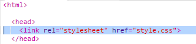
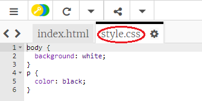
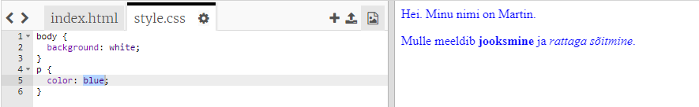

## Mis on CSS?

CSS tähistab **kaskaadlaadistikku ehk astmelisi stiililehti** ja seda keelt kasutatakse veebisaitide kujundamiseks ning nende kenaks muutmiseks.

+ See kood seob sinu veebisaidi CSS-failiga - vaata, kas leiad selle HTML-dokumendi `<head>`-s:



CSS loetleb kõik konkreetse sildi **omadused**.

+ Klõpsa vahekaardil `style.css`, et näha oma veebisaidi CSS-koodi.
    
    

+ Leia see kood:

```html
p {
värv: must;
}
```

See CSS-kood määrab lõikude (`p`) omadused, mis ütlevad, et teksti värv peaks olema must. Pange tähele Ameerika kirjapilt: "värv".

+ Muuda sõna "must" CSS-koodina "siniseks". Peaksite nägema, et kõigi lõigete tekstivärv muutub siniseks.

