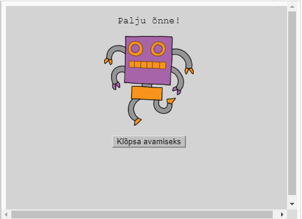
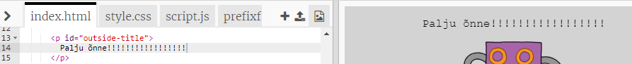
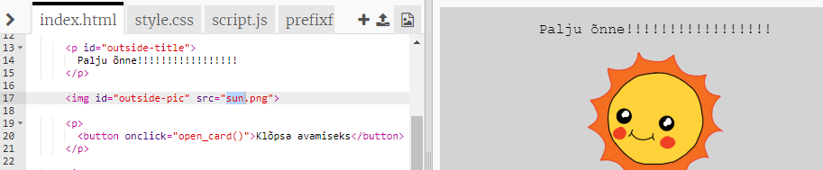
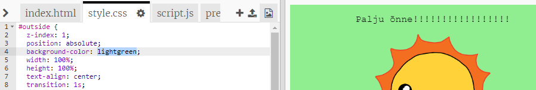
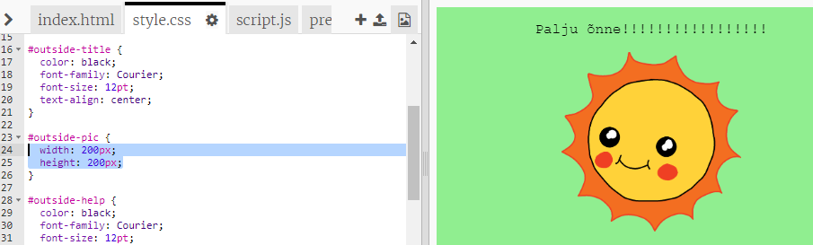
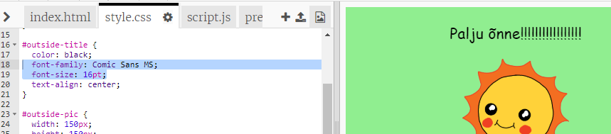

## Sünnipäevakaardi tegemine

Kasuta seda, mida oled õppinud HTML-i ja CSS-i kohta, et luua sinu enda kohandatud sünnipäevakaart.

+ Ava [see trinket](http://jumpto.cc/web-card){:target="_blank"}.

Oleme kirjutanud palju koodi, et saaksid alustada, kuid sünnipäevakaart tundub siiani üsna igav, seega hakkad sina HTML-i ja CSS-koodi mõnevõrra muutma.

+ Klõpsa kaardi esiküljel asuvat nuppu ja peaksid nägema seda avanemas, et paljastada sisu.

+ Mine HTML-koodi 14. reale. Proovi oma kaardi kohandamiseks teksti redigeerida.

+ Kas leiad roboti pildi HTML-koodi ja kas oskad muuta sõna `robot` `päikeseks`?

\--- hints \--- \--- hint \---

+ Koodi leidmiseks vaata rida 17.
+ Muuda sõna `robot` `päikeseks`ja näed, kuidas pilt muutub!

 \--- /hint \--- \--- /hints \---

Võid kasutada ükskõik millist järgnevatest sõnadest `poiss`, `teemant`, `dinosaurus`, `lilled`, `tüdruk`, `vikerkaar`, `robot`, `kosmoselaev`, `päike`, `tee` või `trofee` sünnipäevakaardi jaoks või `paukrakett`, `päkapikk`, `pingviin`, `kingitus`, `põhjapõder`, `jõuluvana` või `lumememm`, kui eelistaksid teha jõulukaarti.

Samuti saad muuta sünnipäevakaardi CSS-koodi.

+ Vajuta vahelehte `style.css`. Esimene osa on kõik CSS-i stiilid kaardi **välisosa** jaoks.

+ Muuda `taustavärv` `heleroheliseks`.

+ Samuti saad muuta pildi suurust. Mine `#välispildi` CSS-koodini ja muuda pildi välisosa `laius` ja `kõrgus` `200px`-ni (`px` tähistab piksleid).

+ Fonti saab ka muuta. Mine `#välispealkirja` CSS-ile ja muuda `fondi perekond` `Comic Sans MS-iks` ja `fondi suurus` `16pt-ks`.

Võid kasutada ka teisi fonte, näiteks:

+ `arial`
+ `Impact`
+ `Tahoma`