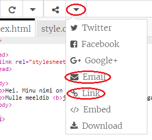

\--- challenge \---

## Väljakutse: loo isikupärane kaart

+ Kasuta isikupärase kaardi tegemiseks kõike, mida oled HTML-i ja CSS-i kohta õppinud. Ja see ei pea olema sünnipäevakaart, see võib olla mõni selline, mille tegid jõuludeks või mõne muu sündmuse jaoks!

Siin on näide:

Rohkem CSS-i värvinimesid leiad [siin](http://jumpto.cc/colours){:target="_blank"}.

+ Kui oled oma kaardi lõpetanud, saad seda kellegagi jagada või selle talle meili teel saata.

\--- /challenge \---