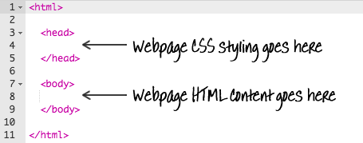
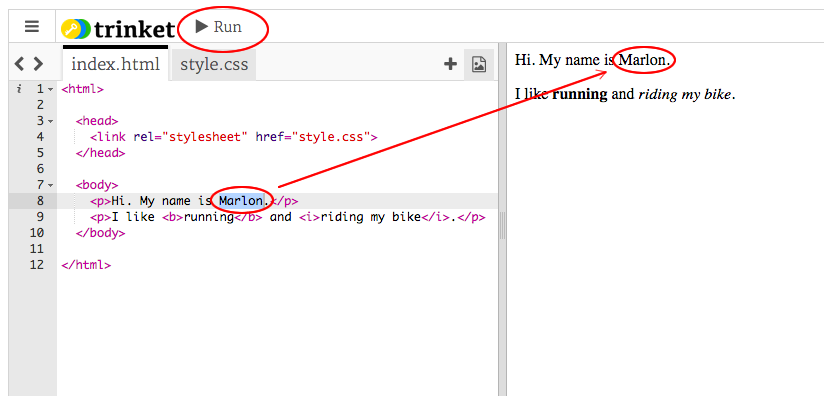
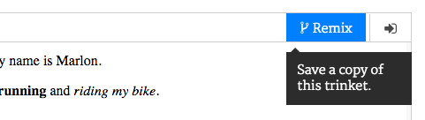

## HTML چیست؟

HTML مخفف عبارت **Hypertext Markup Language**، زبان مورد استفاده برای ایجاد صفحات وب. بیایید نگاهی به مثال بزنیم!

شما برای استفاده از یک وبسایت به نام trinket.io از کد HTML استفاده می کنید.

+ [این نکته را باز کنید](http://jumpto.cc/web-intro){: target = "_ blank"}.

این پروژه باید چنین باشد:


کد شما که می توانید در سمت چپ ببینید HTML است. در سمت راست نینجا، می توانید صفحه وب را که کد HTML ساخته شده است را ببینید.

HTML با استفاده از **برچسب ها** برای ساخت صفحات وب. برای این کد HTML در خط 8 کد خود نگاه کنید:

```html
<p>سلام نام من اندی است</p>
```

`<p>` نمونه ای از برچسب است و برای **پاراگراف**کوتاه است. شما می توانید یک پاراگراف را با `<p>`و یک پاراگراف را با `</p>`.

+ آیا می توانید تگ های دیگر را مشخص کنید؟

## \--- سقوط - فروپاشی \---

## عنوان: پاسخ

یکی دیگر از برچسب هایی که ممکن است دچار نقص شده باشید `<b>`که به معنای **باجو**:

```html
<b>در حال اجرا</b>
```

در اینجا چند مورد دیگر وجود دارد:

+ `<html>` و `</html>` علامت شروع و پایان سند HTML است
+ `<head>` و `</head>` جایی است که چیزهایی مانند CSS می رود (ما بعدا به آن دسترسی خواهیم داشت)
+ `<body>` و `</body>` جایی است که محتوای وب سایت شما در آن قرار دارد



\--- /سقوط - فروپاشی \---

+ تغییر در یکی از پاراگراف های متن در فایل HTML (در سمت چپ). کلیک کنید **اجرا**، و شما باید تغییر صفحه وب خود را (در سمت راست) را ببینید!



+ اگر شما را ساخته اند اشتباه و می خواهید را به خنثیسازی همه از تغییرات خود را، شما می توانید با کلیک بر روی **منوی** را فشار دهید و سپس کلیک کنید **تنظیم مجدد**.


برای لغو تنها آخرین چیزی که شما انجام دادید، می توانید کلید `Ctrl` و `z` با هم فشار دهید.

### برای صرفه جویی در پروژه های خود، به حساب کاربری Trinket نیاز ندارید!

اگر حساب کاربری Trinket نداشته باشید، روی فلش **down** کلیک کنید و سپس **لینک**کلیک کنید. این به شما یک لینک می دهد که می توانید آن را ذخیره کنید و بعدا به آن بازگردید. شما باید هر بار که تغییرات را انجام می دهید این کار را انجام دهید، زیرا لینک تغییر خواهد کرد!


اگر حساب کاربری Trinket داشته باشید، ساده ترین راه برای ذخیره صفحه وب شما این است که بر روی دکمه **Remix** در بالای صفحه کلید کلیک کنید. این یک نسخه از شلوار جین در نمایه شما را ذخیره می کند.

