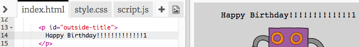

## ساخت کارت تولد

اجازه دهید از آنچه شما در مورد HTML و CSS آموخته اید برای ایجاد کارت تولد سفارشی خود استفاده کنید.

+ Open [this trinket](https://trinket.io/html/b33e4f4ca8){:target="_blank"}.

ما کد زیادی را برای آغاز کار خود نوشته ایم، اما کارت تولد تا به حال خیلی خسته کننده است، بنابراین شما قصد دارید تغییراتی در کد HTML و CSS ایجاد کنید.

+ بر روی دکمه روی جلوی کارت کلیک کنید و باید آن را باز کنید تا داخل ظاهر شود.

+ به خط 14 کد HTML بروید برای نوشتن کارت خود، متن را ویرایش کنید

+ آیا می توانید کد HTML را برای تصویر ربات پیدا کنید و کلمه `robot` to `sun`عوض کنید؟

\--- نکات \--- \--- \--- اشاره

+ کد 17 را در خط 17 نگاه کنید.
+ تغییر کلمه `ربات` به `خورشید`، و شما تغییر تصویر را ببینید!

\--- /hint \--- \--- /hints \---

You can use any of the words `boy`, `diamond`, `dinosaur`, `flowers`, `girl`, `rainbow`, `robot`, `spaceship`, `sun`, `tea`, or `trophy` for a birthday card, or `cracker`, `elf`, `penguin`, `present`, `reindeer`, `santa`, or `snowman` if you would prefer to make a Christmas card.

You can also edit the CSS code of the birthday card.

+ بر روی زبانه برای `style.css`کلیک کنید. بخش اول همه سبکهای CSS برای **خارج از** کارت است.

+ `پس زمینه رنگ` تا `نور سبز`.

+ شما همچنین می توانید اندازه یک تصویر را تغییر دهید. به کد `# outside-pic` و `عرض` و `ارتفاع` تصویر خارج را به `200 پیکسل` (`پیکسل` پیکسل).

+ فونت نیز می تواند تغییر کند. به `# outside-title` CSS بروید و `فونت-خانوادگی` تا `Comic Sans MS` و `فونت-اندازه` تا `16pt`.

You can use other fonts, for example:

+ `arial`
+ `ضربه`
+ `Tahoma`