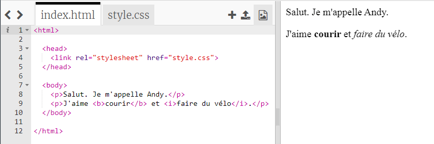
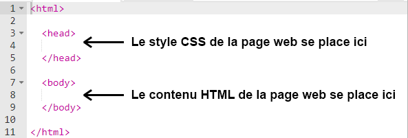
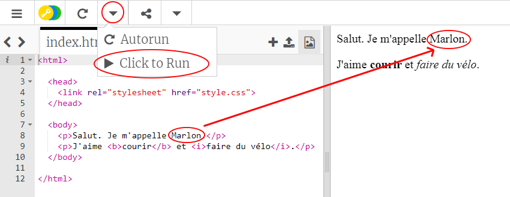
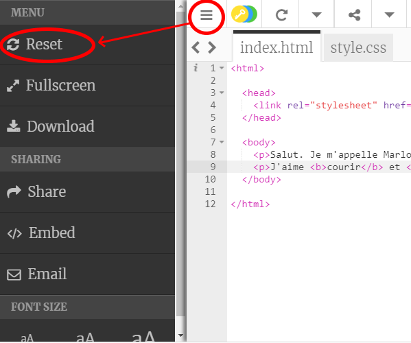
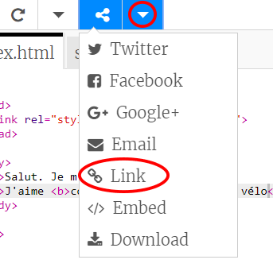
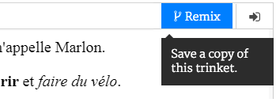

## Qu'est-ce que le HTML ?

HTML signifie **Hypertext Markup Language** (langage de balisage d’hypertexte), le langage utilisé pour créer des pages web. Jetons un coup d’œil à un exemple !

Tu utiliseras un site web appelé trinket.io pour écrire du code HTML.

+ Ouvre [ce trinket](https://trinket.io/html/46a7cd9bf7){:target="_blank"}.

Le projet doit ressembler à ça :



Le code que tu peux voir sur la gauche est du HTML. À droite du trinket, tu peux voir la page web que le code HTML formate.

HTML utilise des **balises** pour construire des pages web. Trouve ce code HTML à la ligne 8 :

```html
<p>Salut, je m'appelle Andy.</p>
```

`<p>` est un exemple de balise et est un raccourci pour **paragraphe** . Tu peux commencer un paragraphe avec `<p>` et terminer un paragraphe avec `</p>` .

+ Peux-tu repérer d'autres balises ?

--- collapse ---
---
title: Réponse
---

Une autre balise que tu peux avoir repérée est `<b>`, qui signifie **gras** (bold) :

```html
<b>en cours d’exécution</b>
```

Voici quelques autres :

+ `<html>` et ` </html>` marquent le début et la fin du document HTML
+ `<head>` et ` </head>` sont où iront des choses comme CSS (nous y reviendrons plus tard)
+ `<body>` et ` </body>` sont où le contenu de ton site Web va



--- /collapse ---

+ Apporte une modification à un des paragraphes du texte dans le fichier HTML (sur la gauche). Clique sur **Run**, et tu devrais voir ta page web changer (sur la droite) !



+ Si tu as fais une erreur et tu souhaites annuler toutes tes dernières modifications, tu peux aller dans **menu**et cliquer sur **Reset**.



Pour annuler juste la dernière action que tu as faite, tu peux appuyer sur les touches `Ctrl` et `z` en même temps.

### Tu n'as pas besoin de compte Trinket pour sauvegarder tes projets !

Si tu n'as pas de compte Trinket, clique sur le flèche vers le **bas** et clique ensuite sur **Link**. Cela te donnera un lien que tu peux enregistrer pour revenir plus tard. Tu devras le faire chaque fois que tu fais des modifications car le lien changera !



Si tu as un compte Trinket, le moyen le plus simple pour enregistrer ton projet est de cliquer sur le bouton **Remix** au dessus du Trinket. Cela va enregistrer une copie du Trinket dans ton profil.

