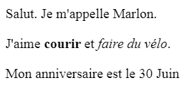

\--- challenge \---

## Défi: Ajouter un autre paragraphe

- Peux-tu ajouter un troisième paragraphe de texte sur ta page web, sous les deux autres ?

Rappelle-toi que ton nouveau paragraphe doit commencer par une balise `
`, et se finir par une autre balise `
`.

Voici à quoi doit ressembler ta page web :

Peux-tu ajouter du texte **en gras** et <u>souligné</u>à ton nouveau paragraphe ? Utilise les balises `<u>` et `</u>` pour souligner le texte.

\--- /challenge \---