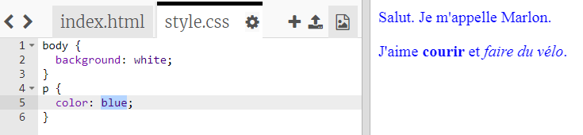

## Qu'est-ce que le CSS ?

CSS est l’acronyme de **Cascading Style Sheets** (Feuilles de Styles en Cascade), et c’est un langage utilisé pour modifier l'apparence graphique des pages web et leur donner un aspect agréable.

+ Ce code relie ta page web au fichier CSS - regarde si tu peux le trouver dans le `<head>` du document HTML:


Le CSS liste toutes les **propriétés** pour une balise particulière.

+ Clique sur l'onglet `style.css` pour voir le code CSS de ta page web.
    
    

+ Trouve ce code:

```html
p {
    color: black;
}
```

Ce code CSS détermine les propriétés des paragraphes (`p`), et dit que la couleur du texte doit être en noir.

+ Change le mot "black" en "blue" dans le code CSS. Tu devrais voir la couleur du texte de tous les paragraphes changer en bleu.

