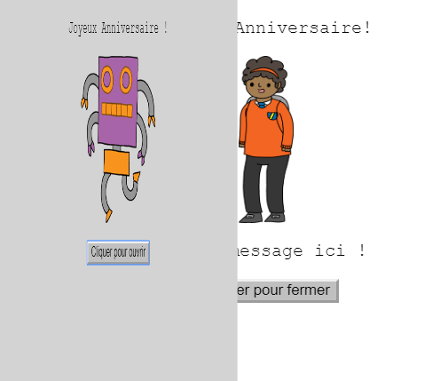
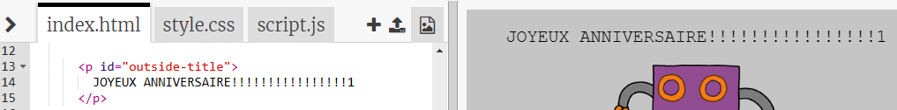
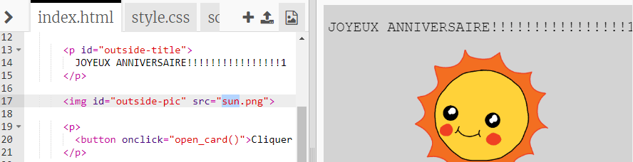
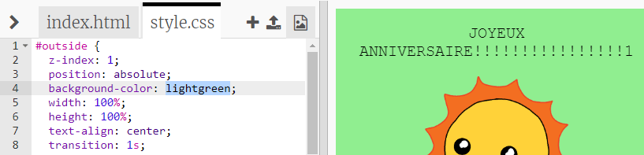
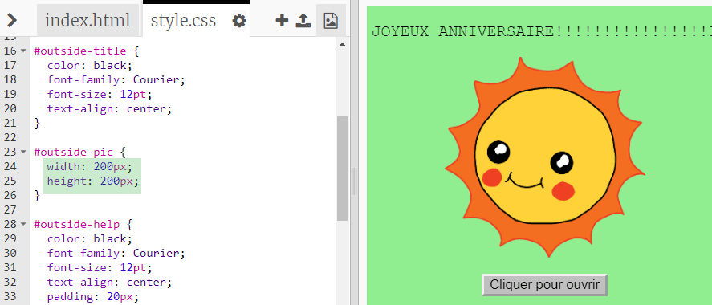
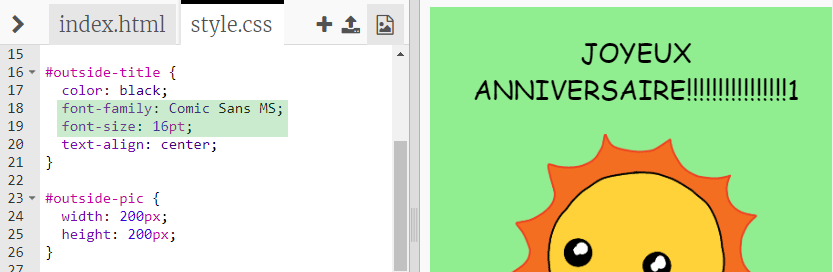

## Faire une carte d'anniversaire

Utilisons ce que tu as appris sur le HTML et le CSS pour faire ta propre carte d'anniversaire personnalisée.

+ Open [this trinket](https://trinket.io/html/b33e4f4ca8){:target="_blank"}.

Nous avons écris beaucoup de code pour t'aider à démarrer, mais la carte d'anniversaire semble plutôt ennuyeuse pour le moment, donc tu vas faire quelques changements au code HTML et CSS.

+ Clique sur le bouton sur le devant de la carte, et tu devrais voir que la carte s'ouvre pour révéler l'intérieur.

+ Va à la ligne 14 du code HTML. Essaie de modifier le texte pour personnaliser ta carte.

+ Peux-tu trouver le code HTML pour l'image du robot, et modifier le mot `robot` par `sun`?

\--- hints \--- \--- hint \---

+ Regarde à la ligne 17 et trouve le code.
+ Change le mot `robot` par `sun`, et tu verras l'image changer !

 \--- /hint \--- \--- /hints \---

Tu peux utiliser l'un de ces mots `boy`, `diamond`, `dinosaur`, `flowers`, `girl`, `rainbow`, `robot`, `spaceship`, `sun`, `tea`, or `trophy` for a birthday card, or `cracker`, `elf`, `penguin`, `present`, `reindeer`, `santa`, or `snowman` if you would prefer to make a Christmas card.

Tu peux également modifier le code CSS de la carte d'anniersaire.

+ Clique sur l'onglet `style.css`. La première partie est tous les styles CSS pour **l'extérieur** (outside) de la carte.

+ Change la couleur de fond `background-color` à vert clair `lightgreen`.

+ Tu peux aussi modifier la taille de l'image. Va sur le code CSS de `#img-exterieur` et change la largeur `width` et la hauteur `height` de l'image extérieur à `200px` (`px` signifie pixels).

+ La fonte peut aussi être changer. Va sur le CSS `#titre-exterieur` et change la propriété `font-family` à `Comic Sans MS` et la taille de la fonte `font-size` à `16pt`.

Tu peux utiliser d'autres polices, par exemple:

+ `arial`
+ `Impact`
+ `Tahoma`