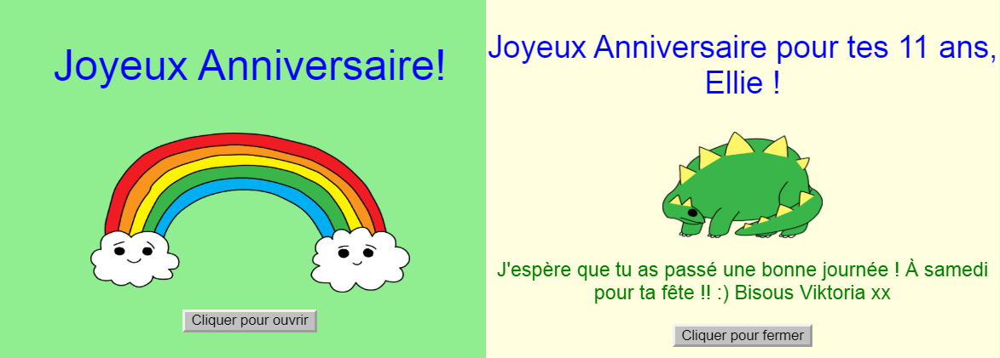
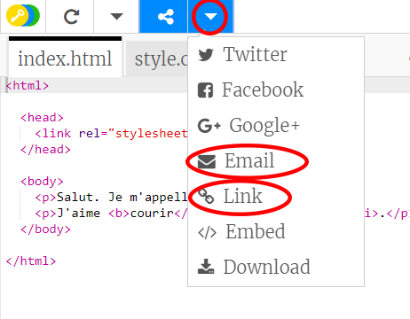

\--- challenge \---

## Défi: créer une carte personnalisée

+ Utilise tout ce que tu as appris sur HTML et CSS pour finir de créer une carte personnalisée. Et ça ne doit pas forcément être une carte d'anniversaire, ça pourrait être une carte de Noël ou toute autre occasion!

Voici un exemple :

Tu peux trouver plus de noms de couleurs CSS [ici](http://jumpto.cc/colours){:target= "_blank"}.

+ Une fois que tu as terminé ta carte, tu peux la partager ou l'envoyer par e-mail à quelqu'un.

\--- /challenge \---