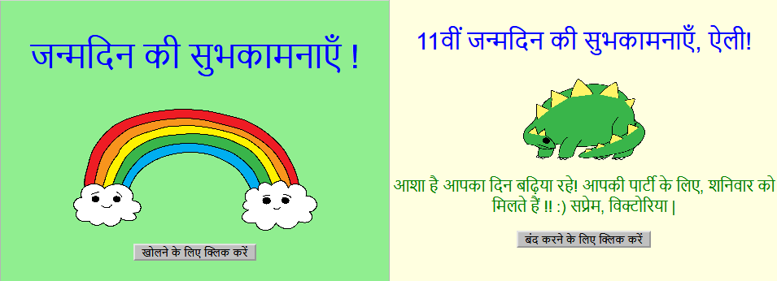

## परिचय

इस परियोजना में, आपका अपना स्वनिर्धारित जन्मदिन कार्ड कैसे बनाया जाये को सीखकर आपको HTML और CSS से परिचित कराया जाएगा।

### आप क्या बनाएँगे

जन्मदिन कार्ड खोलने के लिए बटन पर क्लिक करें:

  <iframe src="https://trinket.io/embed/html/c3d52cf65c?outputOnly=true&start=result" width="600" height="450" frameborder="0" marginwidth="0" marginheight="0" allowfullscreen>
  </iframe>
  

### आप क्या सीखेंगे

ये परियोजना [Raspberry Pi डिजिटल निर्माण पाठ्यक्रम](http://rpf.io/curriculum){:target="_blank"} के निम्नलिखित तत्वों को सम्मिलित करता है:

+ [ बुनियादी 2D और 3D सामग्री डिजाइन करें ](https://www.raspberrypi.org/curriculum/design/creator) {: लक्ष्य = "_ blank"}।

### शिक्षकों के लिए अतिरिक्त जानकारी

अगर आपको इस परियोजना को प्रिंट करने की आवश्यकता है, तो कृप्या [प्रिंटर-अनुकूल संस्करण](https://projects.raspberrypi.org/en/projects/happy-birthday/print){: target = "_ blank"} का उपयोग करें।

इस परियोजना के GitHub रेपो तक पहुंँचने के लिए फुटर में दिए लिंक का उपयोग करें, जिसके 'en/resources’ फोल्डर के अंदर सभी संसाधन (एक पूर्ण परियोजना के उदाहरण सहित) हैं।