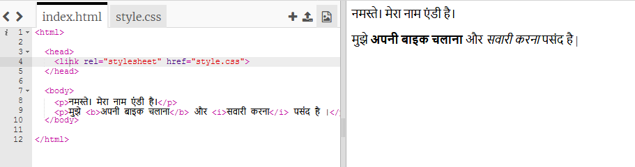
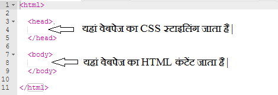
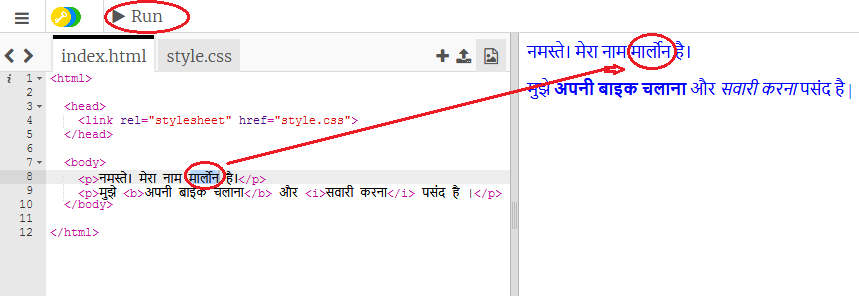
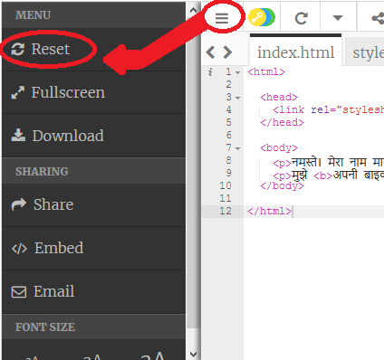
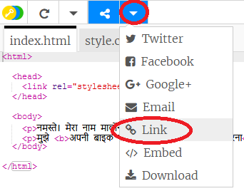
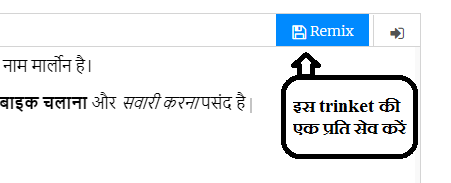

## HTML क्या है?

HTML का अर्थ **हाइपरटेक्स्ट मार्कअप लैंग्वेज** है, वह भाषा जो वेबपेज बनाने के लिए उपयोग की जाती है। आइए एक उदाहरण देखें!

आप HTML कोड लिखने के लिए trinket.io नामक वेबसाइट का उपयोग करेंगे।

+ खोलें [यह ट्रिंकेट](https://trinket.io/html/3a78b3be4b){:target="_blank"}।

यह परियोजना इस तरह दिखनी चाहिए:



जो कोड आप बाईं ओर देख सकते हैं वह HTML है। ट्रिंकेट के दाईं ओर, आप HTML कोड द्वारा बनाया गया वेबपेज देख सकते हैं।

HTML वेबपृष्ठ बनाने के लिए **टैग्स** का उपयोग करता है । इस HTML कोड को अपने कोड की 8वी पंक्ति पर देखें:

```html
<p>नमस्ते | मेरा नाम एंडी है |</p>
```

एक टैग का एक उदाहरण है, जो **paragraph** के लिए है । आप एक पैराग्राफ 

के साथ शुरू कर सकते हैं, और  के साथ समाप्त कर सकते हैं ।

+ क्या आप कोई अन्य टैग खोज सकते हैं?

--- collapse ---
---
title: उत्तर
---

एक दूसरा टैग जो अपने खोजा हो सकता है, जो **बोल्ड** के लिए है:</p> 

```html
<b>दौड़ना</b>
```

यहाँ कुछ और हैं:

+ `<html>` और `</html>` HTML लेख का शुरुआत और अंत अंकित करते हैं ।
+ `<head>` और `</head>` वह स्थान है जहाँ CSS जैसी चीज़ें रखी जाती है (हम उसपर बाद में आएंगे)
+ `<body>` और `</body>` वह स्थान है जहाँ आपकी वेबसाइट की सामग्री रखी जाती है



--- /collapse ---

+ HTML फ़ाइल में (बाईं ओर) एक पैराग्राफ के पाठ में एक बदलाव करें। **Run** पर क्लिक करें, और आपको अपना वेबपृष्ठ में परिवर्तन (दाईं ओर) दिखना चाहिए!



+ यदि आपने कोई गलती की है और अपने सभी परिवर्तनों को पूर्ववत करना चाहते हैं, तो आप **menu** बटन पर क्लिक करें और फिर **reset** पर क्लिक करें ।



आपके द्वारा की गई अंतिम चीज़ को पूर्ववत करने के लिए, आप `Ctrl` और `z` चांबियाँ साथ में दबा सकते हैं ।

### आपको अपने प्रोजेक्ट सहेजने के लिए Trinket खाते की आवश्यकता नहीं है!

यदि आपके पास Trinket खाता नहीं है, तो **नीचे** के तीर पर क्लिक करें और फिर **Link** (लिंक) पर क्लिक करें। इससे आपको एक लिंक मिलेगा जिसे आप सहेज सकते हैं और बाद में वापस आ सकते हैं। हर बार जब आप परिवर्तन करेंगे, आपको ऐसा करने की आवश्यकता होगी, क्योंकि लिंक बदल जाएगा!



यदि आपके पास एक Trinket खाता है, तो अपने वेबपृष्ठ को सहेजने का सबसे आसान तरीका ट्रिंकेट के शीर्ष पर स्थित **Remix** बटन पर क्लिक करना है । यह आपके प्रोफ़ाइल पर ट्रिंकट की एक कॉपी को सहेजेगा ।

