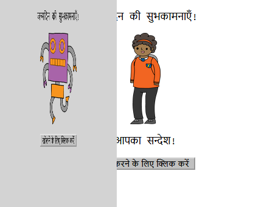
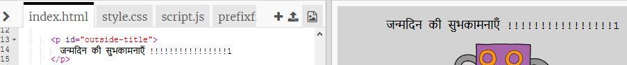
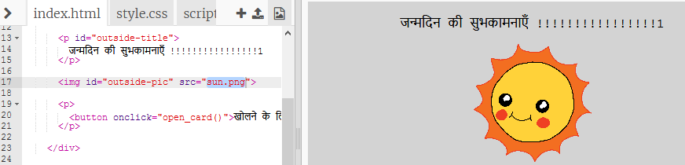
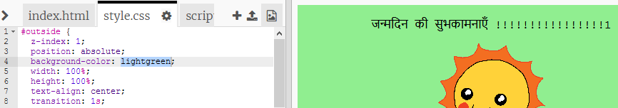
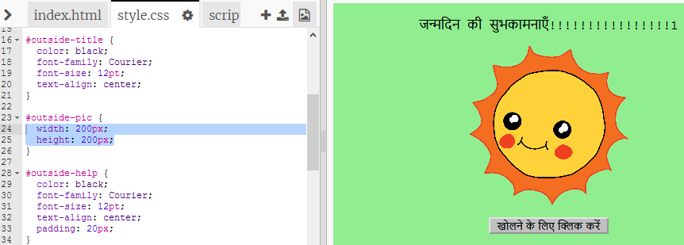
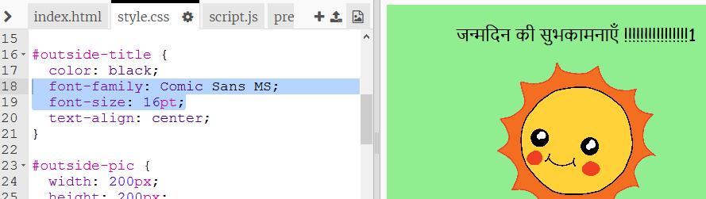

## जन्मदिन का एक कार्ड बनाना

HTML और CSS के बारे में आपने जो सीखा है, आइये उसका उपयोग जन्मदिन का आपका अपना कस्टम कार्ड बनाने के लिए करते हैं।

+ [इस ट्रिंकेट](https://trinket.io/html/fd34434874){:target="_blank"} को खोलें |

आरम्भ करने के लिए हमने बहुत सारे कोड लिखे हैं, परन्तु जन्मदिन का कार्ड अब तक बहुत उबाऊ सा प्रतीत हो रहा है, इसलिए आप HTML और CSS कोड में कुछ बदलाव करने जा रहे हैं।

+ कार्ड के सामने स्थित बटन पर क्लिक करें, और आप इसे खुलकर अंदर का भाग प्रकाशित करते हुए देख पाएंगे ।

+ HTML कोड की लाइन 14 पर जाएं। अपने कार्ड को अनुकूलित करने के लिए पाठ को संपादित करने का प्रयास करें।

+ क्या आप रोबोट छवि के लिए HTML कोड खोज सकते हैं, और `robot` शब्द को `sun` में बदल सकते हैं?

--- hints ---
 --- hint ---

+ कोड खोजने के लिए लाइन 17 पर देखें।
+ `robot` शब्द को `sun` में बदलें, और आप छवि में परिवर्तन देखेंगे!

--- /hint ------ /hints ---

आप इनमें से किसी भी शब्द का उपयोग कर सकते हैं `boy`, `diamond`, `dinosaur`, `flower`, `girl`, `rainbow`, `robot`, `spaceship`, `sun`, `tea`, या `trophy` जन्मदिन कार्ड के लिए, या `cracker`, `elf`, `penguin`, `present`, `reindeer`, `santa`, या `snowman` अगर आप क्रिसमस कार्ड बनाना पसंद करेंगे।

आप जन्मदिन कार्ड का CSS कोड भी संपादित कर सकते हैं।

+ `style.css` के लिए टैब पर क्लिक करें । पहला भाग कार्ड के **बाहर** के CSS styles का है।

+ <color>पृष्ठभूमि-रंग</color> को <color>लाइटग्रीन</color> से बदलें ।

+ आप एक छवि का आकार भी बदल सकते हैं। `#outside-pic` CSS कोड पर जाएं, और बाहर की छवि के `width` और `height` को `200px` में बदलें (`px` पिक्सल के लिए है)।

+ फॉन्ट को भी बदला जा सकता है। `#outside-title` CSS पर जाएं और `font-family` को `Comic Sans MS` और `font-size` को `16pt` में बदलें ।

आप अन्य फोंट का उपयोग कर सकते हैं, उदाहरण के लिए:

+ `Arial`
+ `Impact`
+ `Tahoma`