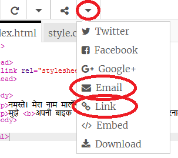

--- challenge ---

## चुनौती: एक निजीकृत कार्ड बनाएँ

+ वैयक्तिकृत कार्ड बनाने के लिए HTML और CSS के बारे में आपने जो कुछ भी सीखा है, उसका उपयोग करें। और ये जन्मदिन कार्ड होना जरूरी नहीं है, यह क्रिसमस या किसी अन्य अवसर के लिए हो सकता है!

यहाँ एक उदाहरण है:

आप अधिक CSS colour के नाम <u>यहां</u>{:target="_blank"} पा सकते हैं ।

+ एक बार जब आप अपना कार्ड पूरा कर लेते हैं, तो आप इसे किसी को साझा या ईमेल कर सकते हैं।

--- /challenge ---

***
समुदाय के योगदान से किया गया अनुवाद

इस परियोजना का अनुवाद ओमकार पिलणकर ने किया है और समीक्षा Saurav द्वारा कि गयी  है।

हमारे अद्भुत अनुवाद स्वयंसेवक हमारी मदद करते है ताकि हम दुनिया भर के बच्चों को कोड करना सीखने का मौका प्रदान कर सके।. आप हमारी परियोजनाओं का अनुवाद करके और अधिक बच्चों तक पहुंचने में हमारी सहायता कर सकते हैं - [rpf.io/translate](https://rpf.io/translate) पर जाकर अधिक जानकारी हासिल करे