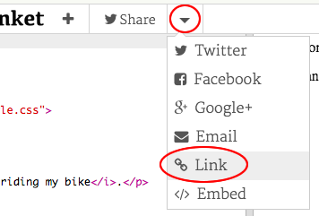

## Što je HTML?

HTML označava **Hypertext Markup Language**, jezik koji se koristi za izradu web stranica. Pogledajmo primjer!

Koristit ćete web stranicu pod nazivom trinket.io za pisanje HTML koda.

+ Otvorite [this trinket](http://jumpto.cc/web-intro){:target="_blank"}.

Projekt bi trebao izgledati ovako:


Kôd koji možete vidjeti s lijeve strane je HTML. S desne strane trikova možete vidjeti web stranicu koju je napravio HTML kôd.

HTML koristi **tags** za izgradnju web stranica. Potražite ovaj HTML kôd na retku 8 koda:

```html
<p>Hi. My name is Andy</p>
```

`<p>` je primjer oznake i kratak je za **paragraph**, Možete započeti stavku s `<p>` i završiti stavku s ` </p>`.

+ Možete li uočiti druge oznake?

## \--- collapse \---

## naslov: Odgovor

Jedna druga oznaka koju ste možda uočili jest `<b>`, što znači ** podebljano **:

```html
<b>running</b>
```

Evo još nekih:

+ `<html>` i ` </html>` označite početak i kraj HTML dokumenta
+ `<head>` i ` </head>` je mjesto gdje stvari poput CSS ide (ćemo doći do toga kasnije)
+ `<body>` i ` </body>` je mjesto gdje vaša web stranica sadržaj ide


\--- /collapse \---

+ Izmijenite jedan od odlomaka teksta u HTML datoteci (slijeva). Kliknite **Run**, i trebali biste vidjeti promjenu svoje web stranice (desno)!


+ Ako ste pogriješili i želite poništiti sve promjene, možete kliknuti **menu**, a zatim kliknite **Reset**.


Da biste poništili posljednju stvar koju ste učinili, možete pritisnuti tipku `Ctrl` i `z` tipke zajedno.

### Ne trebaš imati korisnički račun na Trinketu kako bi spremao svoje projekte!

Ako nemate Trinket račun, kliknite **down** strelicu, a zatim kliknite **Link**. Dobit ćeš poveznicu koju možeš spremiti i otvoriti kasnije. Ovo napravi svaki put kada izmijeniš svoj program zato što će se i poveznica promijeniti!



Ako imate Trinket račun, najlakši način za spremanje web stranice je kliknuti ** Remix ** gumb na vrhu šiške. Time ćete spremiti kopiju trikota na svojem profilu.

