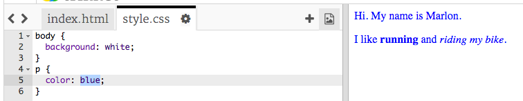

## Što je CSS?

CSS označava **Cascading Style Sheets**, a to je jezik koji se upotrebljava za izradu web stranica i izgleda lijepo.

+ Ovaj kôd povezuje vašu web stranicu s CSS datotekom - pogledajte možete li ga pronaći u `<head>` HTML dokumenta:


CSS navodi sve **properties** za određenu oznaku.

+ Kliknite na `style.css` da biste vidjeli CSS kôd za svoju web stranicu.
    
    

+ Pronađite ovaj kôd:

```html
p {
    color: black;
}
```

Ovaj CSS kôd određuje entitet za stavke (`p`), koji kaže da boja teksta mora biti crna. Obavijestite američki pravopis: "boja".

+ Promijenite riječ "crno" u CSS kodu na "plavo". Trebali biste vidjeti boju teksta svih odlomaka u plavoj boji.

