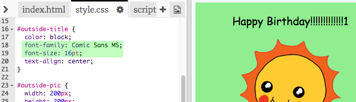

## Izrada rođendanske čestitke

Koristimo ono što ste naučili o HTML-u i CSS-u kako biste napravili svoju vlastitu prilagođenu rođendansku čestitku.

+ Open [this trinket](https://trinket.io/html/b33e4f4ca8){:target="_blank"}.

Napisali smo puno koda da bismo mogli započeti, ali rođendanska kartica dosad je dosadno dosadna, pa ćete napraviti neke izmjene u HTML i CSS kodu.

+ Kliknite gumb na prednjoj strani kartice i vidjet ćete da je otvorena za otkrivanje iznutra.

+ Idite na redak 14 HTML koda. Pokušajte uređivati ​​tekst kako biste prilagodili svoju karticu.

+ Možete li pronaći HTML kôd za sliku robota i promijeniti riječ `robot` do `sun`?

\--- hints \--- \--- hint \---

+ Pogledajte liniju 17 da biste pronašli kôd.
+ Promijenite riječ `robot` do `sun`, i vidjet ćete promjenu slike!

 \--- /hint \--- \--- /hints \---

Možete upotrijebiti bilo koju od riječi `boy`, `diamond`, `dinosaur`, `flowers`, `girl`, `rainbow`, `robot`, `spaceship`, `sun`, `tea`, ili `trophy` za rođendansku čestitku, ili `cracker`, `elf`, `penguin`, `present`, `reindeer`, `santa`, ili `snowman` ako želite izraditi božičnu čestitku.

Također možete urediti CSS kôd rođendanske čestitke.

+ Kliknite karticu za `style.css`, Prvi dio su svi CSS stilovi za **outside** kartice.

+ Promijenite `background-color` u `lightgreen`.

+ Također možete promijeniti veličinu slike. Idite na `#vanjsku-pic` CSS koda i promijenite `width` i `height` vanjske slike na `200px` (`px` označava piksele).

+ Font se može promijeniti. Idite na `#outside-title` CSS i promijenite ` font-family` do `Comic Sans MS` i `font-size` na `16pt`.

Možete koristiti druge fontove, na primjer:

+ `arial`
+ `Impact`
+ `Tahoma`