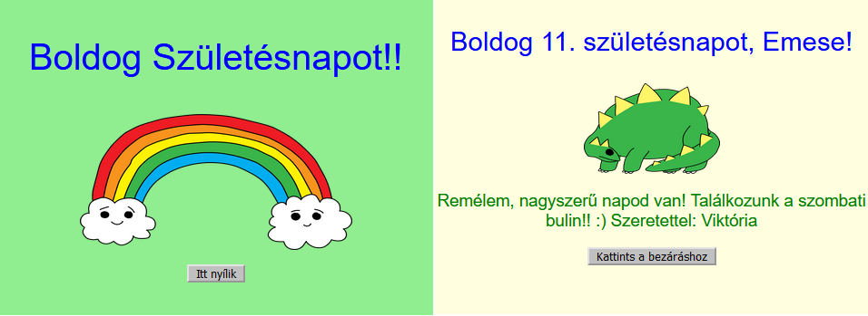

## Bevezetés

Ebben a projektben megismerkedhetsz a HTML-lel és a CSS-sel, miközben elkészíted a saját személyre szabott születésnapi képeslapodat.

### Mit fogsz elkészíteni

Kattints a gombra a születésnapi kártya megnyitásához:

  <iframe src="https://trinket.io/embed/html/c3d52cf65c?outputOnly=true&start=result" width="600" height="450" frameborder="0" marginwidth="0" marginheight="0" allowfullscreen>
  </iframe>
  

### Mit fogsz megtanulni

Ez a projekt a [Raspberry Pi Digitális Alkotás Tanterv](http://rpf.io/curriculum) alábbi részeiből fed le elemeket: {:target="_blank"}:

+ [Tervezz alapvető 2D és 3D alkotóelemeket](https://www.raspberrypi.org/curriculum/design/creator){: target = "_ blank"}.

### További információk oktatóknak

Ha ki szeretnéd nyomtatni ezt a projektet, kérjük, használd a [nyomtatóbarát verziót](https://projects.raspberrypi.org/en/projects/happy-birthday/print) {:target="_blank"} .

A láblécben található linkkel elérheted ennek a projektnek a Github repóját, amely tartalmazza az összes forrást (köztük egy teljes példaprojektet) az "en/resources" mappában.