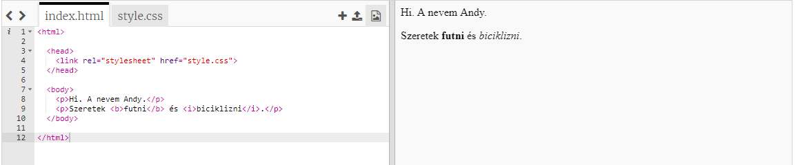
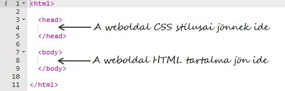
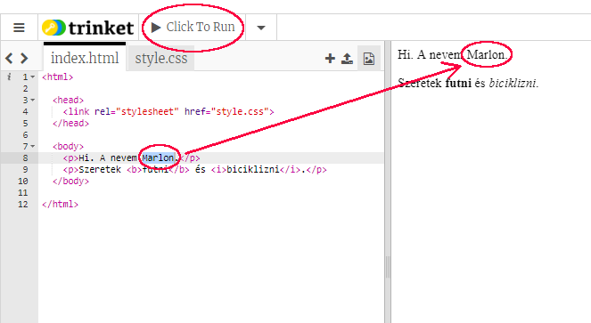
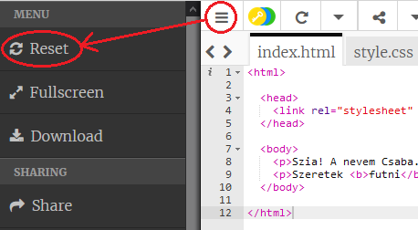
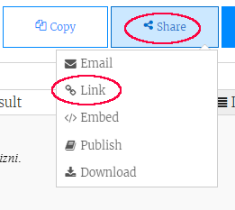
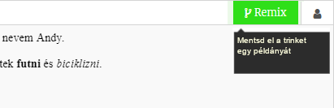

## Mi a HTML?

A HTML jelentése a **Hypertext Markup Language**, a weboldalak elkészítéséhez használt nyelve. Nézzünk egy példát!

A HTML-kód megírásához egy trinket.io nevű webhelyet használsz.

+ Nyisd meg [ez a trinket](http://jumpto.cc/web-intro){: target = "_ blank"}.

A projektnek így kell kinéznie:



A bal oldalon látható kód a HTML. A csecsebecsék jobb oldalán láthatja a HTML kód által létrehozott weboldalt.

A HTML **címkéket használ** weboldalak készítéséhez. Keresse meg ezt a HTML-kódot a kódjának 8. sorában:

```html
<p>Hi. A nevem Andy.</p>
```

`<p>` egy címke egy példája, és rövid a ****bekezdéshez. Elindíthat egy bekezdést `<p>`, és egy bekezdést befejezhet `</p>`.

+ Le tudsz találni más címkéket?

## \--- összeomlás \---

## cím: Válasz

Egy másik címke, amelyet észrevettél, `<b>`, azaz **vastag**:

```html
<b>futás</b>
```

Íme néhány:

+ `<html>` és `</html>` jelölje meg a HTML dokumentum kezdetét és végét
+ `<head>` és `</head>` ahol a CSS, mint a CSS megy (később meglátjuk)
+ `<body>` és `</body>` ahol a webhely tartalmai megyek



\--- / összeomlás \---

+ Módosítsa a HTML fájlban található szövegrészek valamelyikét (a bal oldalon). Kattintson a ****futtatásra, és látnia kell a weboldal módosítását (a jobb oldalon)!



+ Ha hibát vétettél, és visszavonni szeretnéd az összes módosítást, akkor kattints a **menü** gombra, majd kattints a **Reset**gombra.



A legutolsó dolog visszavonásához nyomja meg a `Ctrl` és `z` billentyűt.

### Nem kell Trinket fiókkal menteni a projekteket!

Ha nincs csecsebecsét fiókkal, kattintson a **lefelé** nyílra, majd kattintson a **link**. Ez egy olyan linket ad Önnek, amelyet menthet és később visszatérhet. Mindig ezt meg kell tennie, amikor módosítja a változtatásokat, ahogy a link megváltozik!



Ha van Trinket-fiókod, akkor a weboldal mentésének legegyszerűbb módja, ha kattints a **Remix** gombra a csecsebecse tetején. Ezzel menteni fogja a csecsebecsék egy példányát a profilodon.

