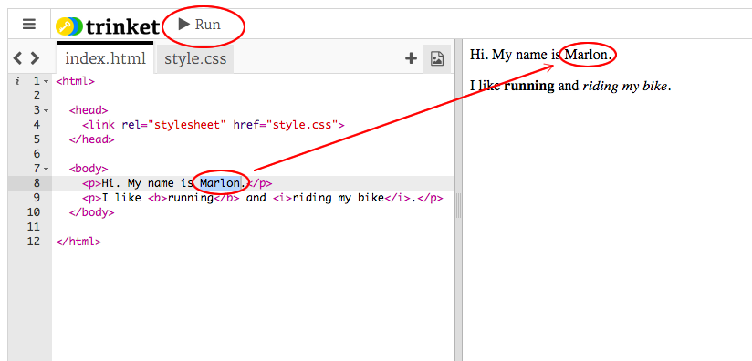

## Mi a HTML?

A HTML jelentése a **Hypertext Markup Language**, a weboldalak elkészítéséhez használt nyelve. Nézzünk egy példát!

A HTML-kód megírásához egy trinket.io nevű webhelyet fogsz használni.

+ Nyisd meg [ezt a trinket](http://jumpto.cc/web-intro){: target = "_ blank"}.

A projektnek így kell kinéznie:


A bal oldalon látható kód a HTML. A trinket jobb oldalán láthatod a HTML kód által létrehozott weboldalt.

A HTML **címkéket használ** weboldalak készítéséhez. Keresse meg ezt a HTML-kódot a kódjának 8. sorában:

```html
<p>Hi. A nevem Andy.</p>
```

`<p>` egy címke egy példája, és rövid a ****bekezdéshez. Elindíthat egy bekezdést `<p>`, és egy bekezdést befejezhet `</p>`.

+ Tudsz találni más címkéket?

## \--- összeomlás \---

## cím: Válasz

Egy másik címke, amelyet észrevehettél, `<b>`, amelynek jelentése **vastag**:

```html
<b>futás</b>
```

Íme még néhány:

+ `<html>` és `</html>` jelöli a HTML dokumentum kezdetét és végét
+ `<head>` és `</head>` ahol a CSS, mint a CSS megy (később meglátjuk)
+ `<body>` és `</body>` ahol a weboldalad tartalmai működnek


\--- / összeomlás \---

+ Módosítsd a HTML fájlban található szövegrészek valamelyikét (a bal oldalon). Kattints a **futtatásra**, és látnod kell a weboldal módosítását (a jobb oldalon)!



+ Ha hibát vétettél, és szeretnéd visszavonni az összes módosítást, akkor kattints a **menü** gombra, majd kattints a **Reset** gombra.


A legutolsó dolog visszavonásához nyomd meg a `Ctrl` és `z` billentyűt.

### Nem kell Trinket fiók a projekt mentéséhez!

Ha nincs Trinket fiók, kattints a **lefelé** nyílra, majd kattints a **link**. Ez egy olyan linket ad, amelyet elmenthetsz és később visszatérhetsz. Ezt mindig meg kell tenned ha változtatsz, mert a link is változni fog!


Ha van Trinket-fiókod, akkor a weboldal mentésének legegyszerűbb módja, hogy kattints a **Remix** gombra a trinket tetején. Ezzel menteni fogja a trinket egy példányát a profilodban.

