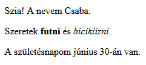

\--- challenge \---

## Kihívás: adj hozzá egy másik bekezdést

- Hozzá tudod adni a szöveg egy harmadik bekezdését a weboldaladhoz, a másik kettő alá?

Ne feledd, hogy az új bekezdésnek `
` címkével kell kezdődnie, és `
` címkével kell végződnie.

Így néz ki a weblapod:

Hozzá tudsz adni **félkövér** és <u>aláhúzott</u> szöveget az új bekezdéshez? Használj `<u>` és `</u>` címkét az aláhúzott szöveghez.

\--- / challenge \---