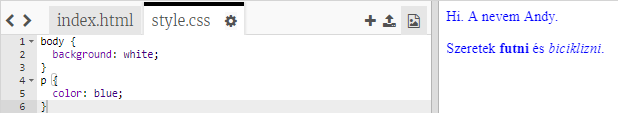

## Mi a CSS?

A CSS jelentése **Cascading Style Sheets**, és ez egy olyan nyelv, amely a weblapok stílusát és szép megjelenését teszi lehetővé.

+ Ez a kód a weboldaladat egy CSS-fájlhoz kapcsolja - keresd meg a HTML dokumentumod `<head>` részében:


A CSS felsorolja az adott címke összes **tulajdonságát**.

+ Kattints a `style.css` lapra a weboldalad CSS kódjának megtekintéséhez.
    
    

+ Keresd meg ezt a kódot:

```html
p {
    color: black;
}
```

Ez a CSS kód határozza meg a bekezdésekhez (`p`) tartozó tulajdonságot, amely megmondja, hogy a szöveg színe fekete lesz. A tulajdonság az amerikai helyesírást használja: 'color'.

+ Módosítsd a CSS kódban a színt feketéről (black) kékre (blue). Láthatod, hogy minden szöveg színe kékre változik.

