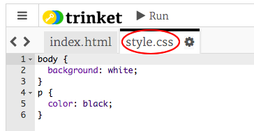

## Mi a CSS?

A CSS jelentése **Cascading Style Sheets**, és ez egy olyan nyelv, amely a weblapok stílusát és szép megjelenését teszi lehetővé.

+ Ez a kód az Ön weboldalát egy CSS-fájlba köti össze - nézze meg, találja-e azt a HTML-dokumentum `<head>`:


A CSS felsorolja az adott címke összes **tulajdonságát**.

+ Kattintson a `style.css` lapra a weboldal CSS kódjának megtekintéséhez.
    
    

+ Keresse meg ezt a kódot:

```html
p {
    szín: fekete;
}
```

Ez a CSS kód határozza meg a (`p`) bekezdésekhez tartozó tulajdonságot, amely szerint a szöveg színe fekete lesz. Figyeld meg az amerikai helyesírást: "szín".

+ Módosítsa a CSS kód "fekete" kifejezését a "kék" kifejezésre. Meg kell látni, hogy a szövegek színe minden kékre változik.

