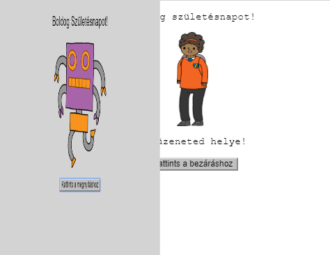
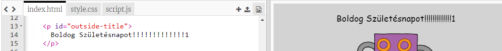
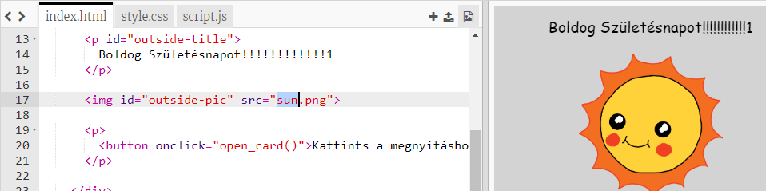
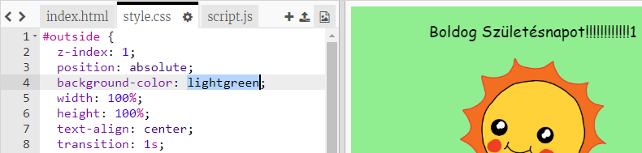
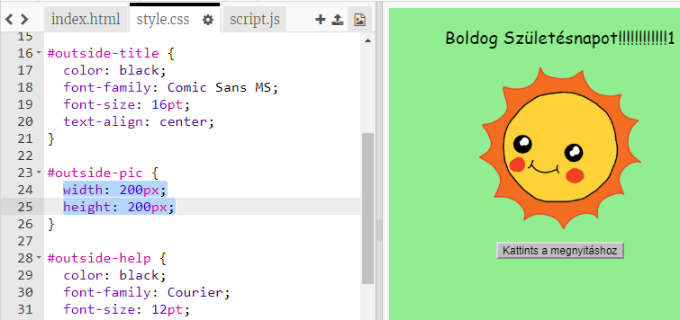
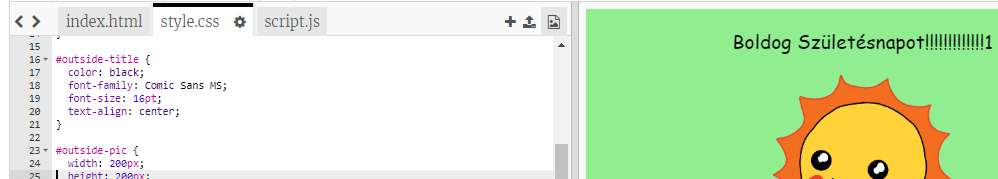

## Születésnapi kártya készítése

Használjuk azt, amit a HTML-ről és a CSS-ről tanultál, hogy elkészítsd a saját születésnapi kártyád.

+ Open [this trinket](https://trinket.io/html/b33e4f4ca8){:target="_blank"}.

Számos kódot írtunk a kezdéshez, de a születésnapi kártya eddig elég unalmasnak tűnik, ezért néhány változtatást fogsz csinálni a HTML és a CSS kódon.

+ Kattints a kártya elején lévő gombra, és nyitottnak kell lenni ahhoz, hogy feltárja a belsejét.

+ Menjen a HTML kód 14. sorára. Próbáld meg szerkeszteni a szöveget a kártya testreszabásához.

+ Meg tudod találni a robot kép HTML kódját, és megváltoztatni a `robot` szót `napra`?

\--- hints \--- \--- hint \---

+ A 17. sorban keresd meg a kódot.
+ Változtasd meg a `robot` szót `napra` és látni fogod, hogy a kép megváltozik!

 \--- /hint \--- \--- /hints \---

Használhatod bármelyik szót `fiú`, `gyémánt`, `dinoszaurusz`, `virágok`, `lány`, `szivárvány`, `robot`, `űrhajó`, `nap`, `tea`, vagy `trófea` egy születésnapi kártyához, vagy `keksz`, `manó`, `pingvin`, `ajándék`, `rénszarvas`, `télapó`, vagy `hóember` ha szeretnél karácsonyi kártyát készíteni.

Szintén szerkesztheted a születésnapi kártya CSS kódját.

+ Kattints a `style.css`lapra. Az első rész az összes CSS-stílus a kártyán **kívüli** részhez.

+ Módosítsd a `háttérszínt` - `világoszöldre`.

+ A kép méretét is megváltoztathatod. Menj a `# képen-kívül` CSS kódra, és változtasd meg a `szélességét` és `magasságát` a külső képnek `200px`-ra (`px` jelentése pixel).

+ A betűtípust is megváltoztathatod. Menj a `# címen kívül` CSS-re és módosítsd a `font-family`-t a `Comic Sans MS`-ra, és a `font-size`-t `16pt`-re.

Használhatsz más betűtípusokat, például:

+ `arial`
+ `Impact`
+ `Tahoma`