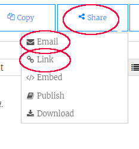

\--- kihívás \---

## Kihívás: személyre szabott kártya létrehozása

+ Használjon mindent, amit megtudott a HTML-ről és a CSS-ről, hogy befejezze a személyre szabott kártyát. És nem kell születésnapi kártya, de karácsonyra vagy más alkalomra lehetne.

Íme egy példa:

Megtalálható több CSS színneveket [itt](http://jumpto.cc/colours){: target = "_ blank"}.

+ Miután befejezte kártyáját, oszthat meg vagy küldhet e-mailt valakinek.

\--- / kihívás \---