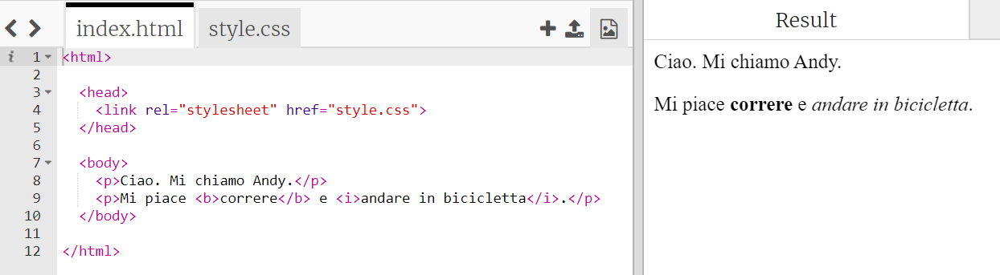
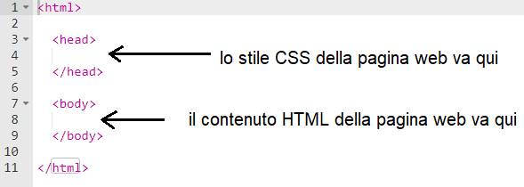
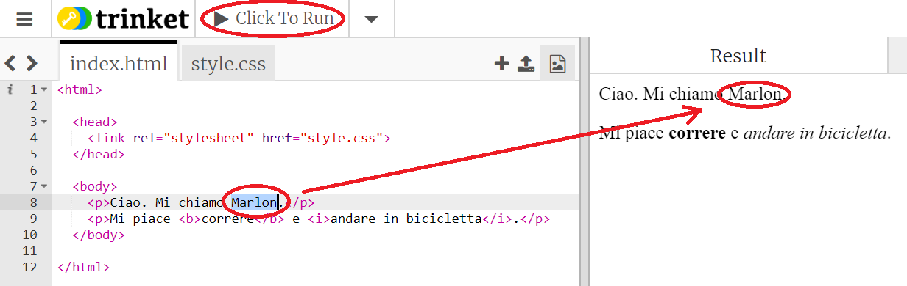
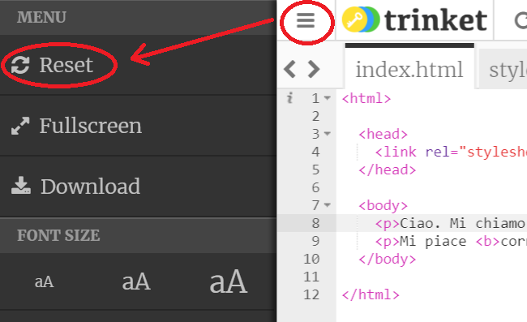
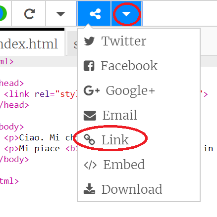

## Cos'è l'HTML?

HTML sta per ** Hypertext Markup Language **, la lingua utilizzata per creare pagine Web. Diamo un'occhiata ad un esempio!

Utilizzerai un sito Web chiamato trinket.io per scrivere codice HTML.

+ Apri [questo trinket](http://jumpto.cc/web-intro)"}.

Il progetto dovrebbe assomigliare a questo:



Il codice che puoi vedere a sinistra è HTML. A destra del trinket, puoi vedere la pagina web creata dal codice HTML.

HTML utilizza i tag ** ** per costruire pagine web. Cerca questo codice HTML sulla riga 8 del tuo codice:

```html
<p> Ciao. Mi chiamo Andy. </p>
```

`<p>` è un esempio di tag ed è abbreviazione di ** paragrafo ** . Puoi iniziare un paragrafo con `<p>` e terminare un paragrafo con ` </p>` .

+ Riesci a individuare altri tag?

## \--- collapse \---

## title: Risposta

Un altro tag che potresti aver individuato è `<b>`, che sta per ** in grassetto **:

```html
<b> in esecuzione </b>
```

Eccone altri:

+ `<html>` e ` </html>` segna l'inizio e la fine del documento HTML
+ `<head>` e ` </head>` è dove vanno cose come i CSS (ci arriveremo più tardi)
+ `<body>` e ` </body>` è dove va il contenuto del tuo sito web



\--- /collapse \---

+ Apporta una modifica a uno dei paragrafi di testo nel file HTML (a sinistra). Fai clic su ** Esegui ** e dovresti vedere la tua pagina web cambiare (a destra)!



+ Se hai fatto un errore e vuoi annullare tutte le modifiche, puoi fare clic sul pulsante **menu** e quindi fare clic su ** Ripristina **.



Per annullare solo l'ultima cosa che hai fatto, puoi premere i tasti ` Ctrl ` e ` z ` insieme.

### Non hai bisogno di un account Trinket per salvare i tuoi progetti!

Se non hai un account Trinket, fai click sulla freccia che punta verso il **basso** e clicca su **Link**. Questo comando ti darà un link che puoi salvare e che potrai aprire di nuovo più tardi. Dovrai fare questa cosa ogni volta che apporti delle modifiche, perché il link cambierà di volta in volta!



Se hai un account Trinket, il modo più semplice per salvare la pagina Web è fare clic sul pulsante ** Remix ** sulla parte superiore del trinket. Questo salverà una copia del trinket sul tuo profilo.

