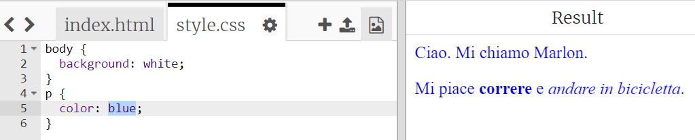

## Cos’è il CSS?

CSS significa __Cascading Style Sheets__. È il linguaggio utilizzato per lo stile delle pagine Web e renderle più belle. Puoi collegare la pagina Web a un file CSS nell’`<head>` di un documento HTML nel modo seguente:


+ Il CSS elenca tutte le __proprietà__ di un tag particolare. Fai clic sulla scheda "style.css" per visualizzare il CSS della tua pagina Web.

	

+ Trova questo codice:

	```
	p {
		color: black;
	}
	```

	Questo codice CSS attribuisce una proprietà ai paragrafi, ossia che il colore del testo sia nero.

+ Nel CSS, cambia la parola "black" con "blue". Vedrai che il colore del testo di tutti i paragrafi diventerà blu.

	
