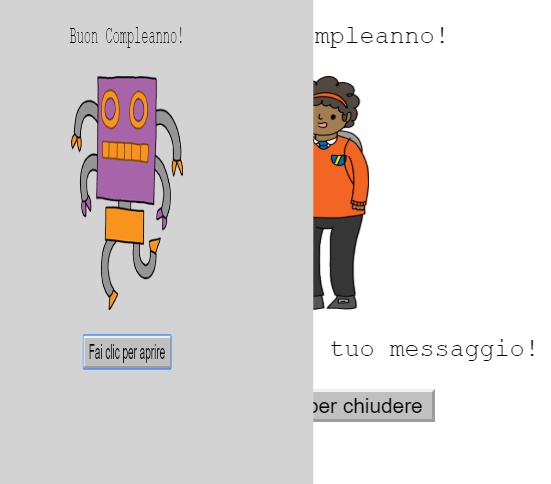
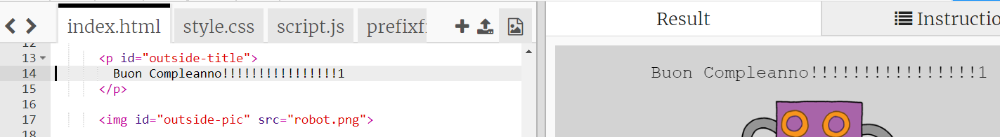
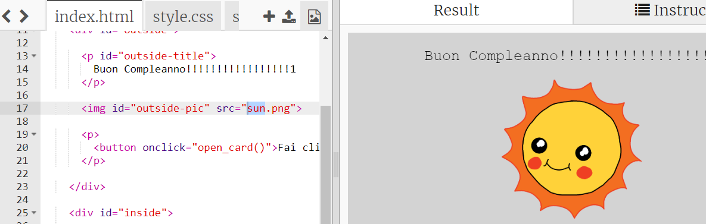
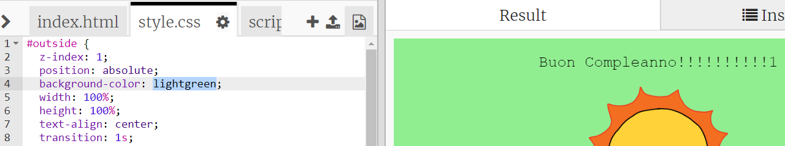
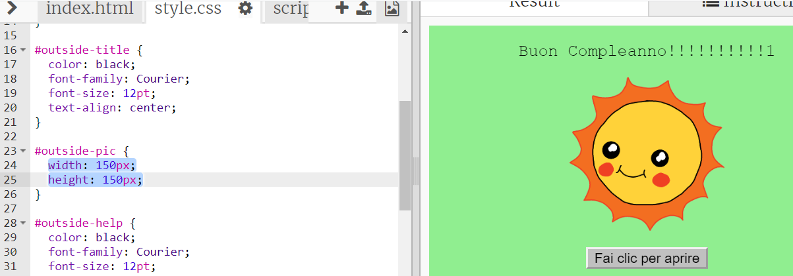
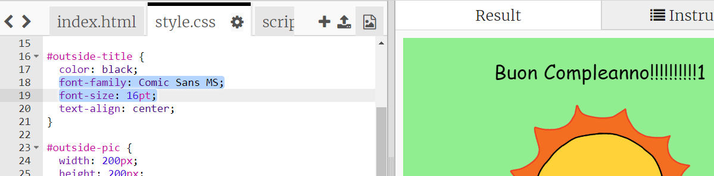

## Creare un biglietto d'auguri

Usiamo quello che hai imparato sull'HTML e su CSS per creare il tuo biglietto d'auguri personalizzato.

+ Apri [questo trinket](https://trinket.io/html/eabe57f33e){:target="_blank"}.

Abbiamo scritto un sacco di codice per iniziare, ma il biglietto d'auguri sembra abbastanza noioso per ora, quindi potrai fare alcune modifiche al codice HTML e CSS.

+ Fai clic sul pulsante sulla parte anteriore del biglietto e si aprirà per rivelare l'interno.

+ Vai alla riga 14 del codice HTML. Prova a modificare il testo per personalizzare il tuo biglietto.

+ Riesci a trovare il codice HTML per l'immagine del robot e modificare la parola `robot` a `sole`?

--- hints ---
 --- hint ---

+ Cerca sulla riga 17 per trovare il codice.
+ Cambia la parola `robot` a `sole` e vedrai l'immagine cambiare!

--- /hint ------ /hints ---

Puoi usare una qualsiasi delle parole `ragazzo`, `diamante`, `dinosauro`, `fiori`, `ragazza`, `arcobaleno`, `robot`, `astronave`, `sole`, `tè` o `trofeo` per un biglietto d'auguri o `cracker`, `elfo`, `pinguino`, `regalo`, `renna`, `babbo natale` o `pupazzo di neve` se preferisci realizzare una cartolina di Natale.

Puoi anche modificare il codice CSS del biglietto d'auguri.

+ Fare clic sulla scheda per `style.css`. La prima parte è costituita da tutti gli stili CSS per **l'esterno** del biglietto.

+ Cambia il `colore di sfondo` a `verde chiaro`.

+ Puoi anche cambiare la dimensione di un'immagine. Vai al codice CSS `#outside-pic` e cambia la `larghezza` e `altezza` dell'immagine esterna a `200px` (`px` sta per pixel).

+ Anche il carattere può essere cambiato. Vai a `# titolo esterno` CSS e modifica la `famiglia di caratteri` a `Comic Sans MS` e la `dimensione del carattere` a `16pt`.

Puoi usare altri caratteri, ad esempio:

+ `Arial`
+ `Impact`
+ `Tahoma`