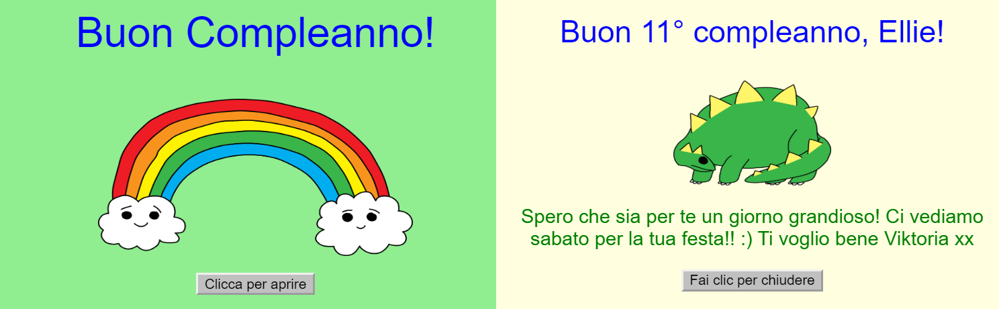
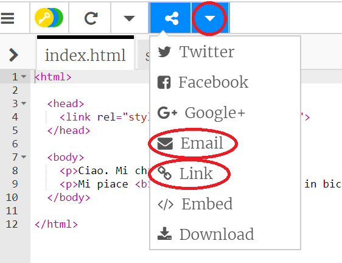

--- challenge ---

## Sfida: crea una cartolina personalizzata

+ Usa tutto ciò che hai imparato su HTML e CSS per completare la creazione di una cartolina personalizzata. E non deve essere un biglietto di compleanno, potrebbe essere uno per gli auguri di Natale o in qualsiasi altra occasione!

Ecco un esempio:

Trova altri nomi di colori CSS [qua](http://jumpto.cc/colours){:target="_blank"}.

+ Una volta terminato il biglietto, puoi condividerlo o inviarlo via email a qualcuno.

--- /challenge ---

***
Questo progetto è stato tradotto da volontari:

Alessandro Mandelli

Raffaella Benelli

Grazie ai volontari, possiamo offrire alle persone di tutto il mondo la possibilità di imparare nella loro lingua. Puoi aiutarci a raggiungere più persone offrendoti come volontario per la traduzione - puoi trovare maggiori informazioni su [rpf.io/translate](https://rpf.io/translate).