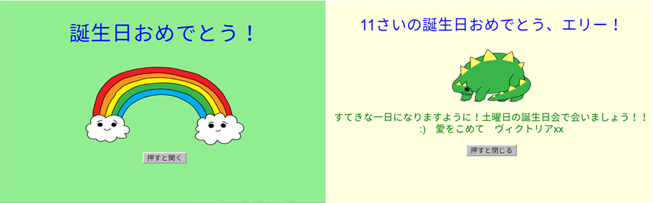

## はじめに

このプロジェクトでは、カスタマイズされたバースデーカードの作成方法を学習することで、HTMLとCSSを紹介します。

### 作るもの

バースデーカードを開くにはボタンをクリックしてください：

  <iframe src="https://trinket.io/embed/html/e996dc0380?outputOnly=true&start=result" width="600" height="450" frameborder="0" marginwidth="0" marginheight="0" allowfullscreen>
  </iframe>
  

### あなたが学ぶもの

このプロジェクトは、[ラズベリーパイデジタルメイクカリキュラムの以下の要素をカバーします](http://rpf.io/curriculum) ：

+ [基本的な2Dおよび3Dアセット](https://www.raspberrypi.org/curriculum/design/creator){：target = "_ blank"}を設計します。

### 教育者のための追加情報

このプロジェクトを印刷する必要がある場合は、 [印刷用バージョン](https://projects.raspberrypi.org/en/projects/happy-birthday/print)を使用してください。

フッターのリンクから、このプロジェクトのGitHubリポジトリにアクセスできます。このリポジトリには、 'en/resources'フォルダ内のすべてのリソース (プロジェクトの完成例を含む) が含まれています。