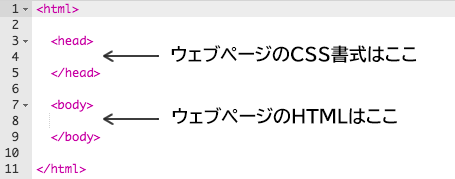
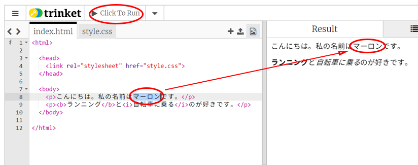
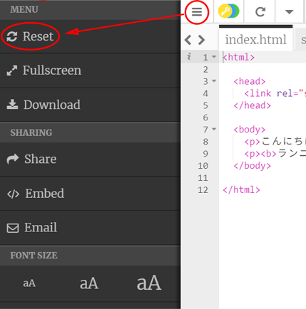
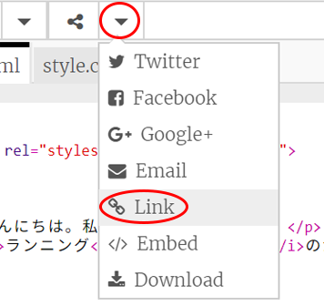
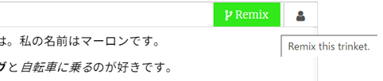

## HTMLとは何ですか？

HTMLとは **Hypertext Markup Language（ハイパーテキストマークアップ言語）**の略で、ウェブページをつくるのに使う言語です。例を見てみましょう！

trinket.ioというウェブサイトを使ってHTMLコードを書いていきます。

+ [このtrinket](http://jumpto.cc/web-intro){:target="_blank"}を開いてください。

プロジェクトはこのようになります。


左側に表示されるコードがHTMLです。trinketの右側には、HTMLコードでつくられたウェブページが表示されます。

HTMLでは**タグ**を使ってウェブページをつくります。コードの8行目にある次のHTMLコードを探しましょう：

```html
<p>こんにちは。私の名前はアンディです。</p>
```

`<p>`はタグの例であり、**paragraph**段落（だんらく）の略です。`<p>`で段落（だんらく）を開始し、`</p>`で段落（だんらく）を終了します。

+ 他のタグを見つけられますか？

## \--- collapse \---

## title: 答え

見つけられるもうの1つのタグは`<b>`で、これは**bold**太字を表します：

```html
<b>ランニング</b>
```

他にもあります：

+ `<html>`と`</html>`はHTML文書の開始と終了を示します。
+ `<head>`と`</head>`にはCSSのようなものが置かれるところです（のちほど説明します）
+ `<body>`と`</body>`にはウェブサイトの内容が置かれます。



\--- /collapse \---

+ （左側の）HTMLファイルにある段落（だんらく）の文字列を変更してみましょう。 **Run**を押すと、（右側に）変更したウェブページが表示されるはずです。



+ 間違えてしまって変更をすべて元に戻したい場合は、**メニュー**ボタンを押し、**Reset**を押します。



最後にやったことだけを元に戻すには、 `Ctrl`と`z`キーを同時に押します。

### プロジェクトを保存するのにTrinketアカウントは必要ありません！

Trinketアカウントをもってない場合は、**下** 矢印を押し、**Link**を押します。 これにより、保存して後で戻ってくることができるリンクが得られます。 リンクが変更されるため、変更するたびにこれを行う必要があります。



Trinketアカウントをもってる場合、ウェブページを保存するいちばんかんたんな方法は、trinketの上部にある**Remix**ボタンを押すことです。これにより、プロファイルにtrinketのコピーを保存します。

