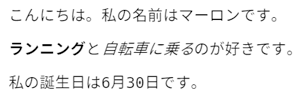

\---挑戦\---

## 課題：別の段落を追加する

- あなたのウェブページに、他の2つの下のテキストの3番目の段落を追加できますか？

新しい段落は `
` タグで始まり、 `
` タグで終わることを覚えておいてください。

あなたのウェブページがどのように見えるかは次のとおりです：

あなたは追加することができます **大胆な** と <u>下線付き</u> あなたの新しい段落にテキストを？下線付きテキストには `<u>` と `</u>` タグを使用します。

\--- /チャレンジ\---