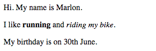

\--- challenge \---

## チャレンジ：段落（だんらく）をもうひとつ追加する

- ウェブページの2つの段落（だんらく）の下に3番目の段落（だんらく）を追加できますか？

新しい段落（だんらく）は`
`タグで始まり、`
`タグで終わることを思い出してください。

ウェブページは次のようになります：

**太字**や<u>下線付き</u>の文字列を新しい段落（だんらく）に追加できますか？下線付き文字列には`<u>`タグと`</u>`タグを使います。

\--- challenge \---