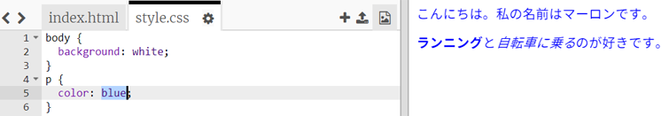

## CSSって何？

CSSは**Cascading Style Sheets（カスケーディングスタイルシート）**の略で、ウェブページの体裁（ていさい）を整えて見栄えを良くするのに使われる言語です。

+ このコードは、ウェブページをCSSファイルにひもづけます—それがHTML文書の`<head>`にあるか確認してください：


CSSは個別のタグの**属性**（ぞくせい）をすべて示します。

+ `style.css`タブを押すと、ウェブページのCSSコードが表示されます。
    
    

+ このコードを見つけてみましょう：

```html
p {
    color: black;
}
```

このCSSコードは、段落（`p`）の属性（ぞくせい）を決定し、文字列の色が黒であることを示します。「color」がアメリカ英語のつづりであることに注意してください。

+ CSSコードの単語「black」を「blue」に変更してみましょう。すべての段落の文字列の色が青色に変わるはずです。

