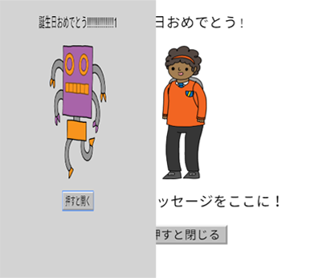
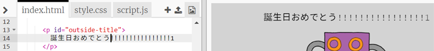
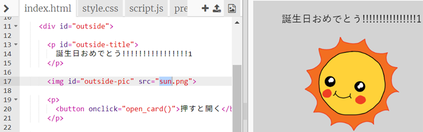
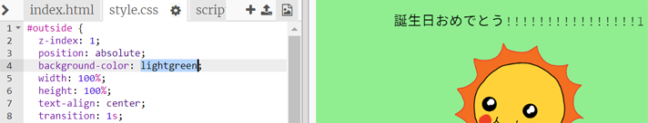
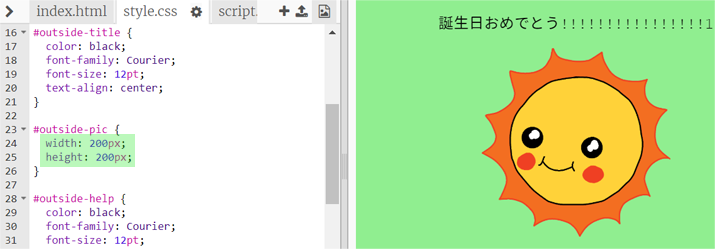
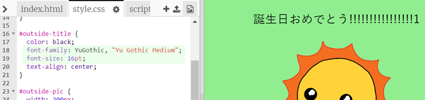

## バースデーカードを作る

独自のカスタムバースデーカードを作るためにHTMLとCSSについて学んだことを使ってみましょう。

+ Open [this trinket](https://trinket.io/html/b33e4f4ca8){:target="_blank"}.

私たちはあなたのために多くのコードを書いていますが、これまでのバースデーカードはかなり退屈なので、HTMLコードとCSSコードを少し変更します。

+ カードの前面にあるボタンをクリックすると、内部が表示されます。

+ HTMLコードの14行目に移動します。テキストを編集してカードをカスタマイズしてみてください。

+ あなたは、ロボット画像のHTMLコードを見つけて、 `ロボット` を `太陽`変更できますか？

\--- hints \--- \--- hint \---

+ 17行目を見てコードを見つけてください。
+ 単語を変更して `ロボット` に `日`、あなたがイメージチェンジを参照してくださいよ！

\--- /hint \--- \--- /hints \---

You can use any of the words `boy`, `diamond`, `dinosaur`, `flowers`, `girl`, `rainbow`, `robot`, `spaceship`, `sun`, `tea`, or `trophy` for a birthday card, or `cracker`, `elf`, `penguin`, `present`, `reindeer`, `santa`, or `snowman` if you would prefer to make a Christmas card.

You can also edit the CSS code of the birthday card.

+ `style.css`タブをクリックします。最初の部分は、のためにCSSスタイルのすべてで **外** カードの。

+ `背景色` を `明るい緑色`ます。

+ 画像のサイズを変更することもできます。 `＃outside-pic` CSSコードに行き、外側の画像の `幅` と `高さ` を `200px` （`ピクセル` はピクセルを表す）に変更します。

+ フォントも変更できます。 `＃outside-title` CSSに行き、 `font-family` を `Comic Sans MS` に、 `font-size` to `16pt`ます。

You can use other fonts, for example:

+ `アリア`
+ `影響`
+ `タホマ`