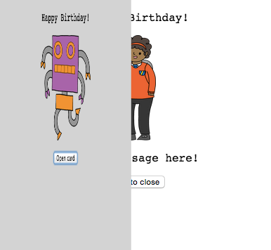

## バースデーカードをつくる

HTMLとCSSについて学んできたことを利用して、独自のバースデーカードをつくってみましょう。

+ [このtrinket](https://trinket.io/html/43ec50a385){:target="_blank"}を開きます。

みなさんがはじめられるようにたくさんのコードを書きましたが、これまでのバースデーカードはかなり退屈なので、HTMLコードとCSSコードを少し変更します。

+ カードの前面にあるボタンを押すと、中が見えるようにカードが開くはずです。

+ HTMLコードの14行目に移動します。文字列を編集してカードを変更してみましょう。

+ ロボット画像のHTMLコードを見つけて、`robot`という単語を`sun`に変更できますか？

--- hints --- --- hint ---

+ コードを見つけるために17行目を見てください。
+ `robot`という単語を`sun`に変更してください。画像が変わるのがわかります！

--- /hint --- --- /hints ---

バースデーカードをつくりたいなら`boy`（少年）、`diamond`（ダイヤモンド）、`dinosaur`（恐竜）、`flowers`（花）、`girl`（少女）、`rainbow`（虹（にじ））、`robot`（ロボット）、`spaceship`（宇宙船）、`sun`（太陽）、`tea`（お茶）、`trophy`（トロフィー）が、クリスマスカードをつくりたいなら、`cracker`（クラッカー）、`elf`（妖精）、`penguin`（ペンギン）、`present`（プレゼント）、`reindeer`（トナカイ）、`santa`（サンタ）、`snowman`(雪だるま)という単語が使えます。

バースデーカードのCSSコードも編集できます。

+ `style.css`タブを押します。最初の部分はカードの**外側**のためのCSS書式すべてです。

+ `background-color`（背景色）を`lightgreen`（薄緑（うすみどり）色）に変更します。

+ 画像の大きさも変更できます。 CSSコードの`#outside-pic`のところに行って、外側の画像の`width`（幅）と`height`（高さ）を`200px`（`px`は画素を表す）に変更します。

+ フォントも変更できます。 CSSの`#outside-title`のところに行って、`font-family`を`YuGothic,'Yu Gothic Medium'`に、`font-size`を`16pt`に変更します。

他のフォントも使えます。例えば：

+ `arial`
+ `Impact`
+ `Tahoma`