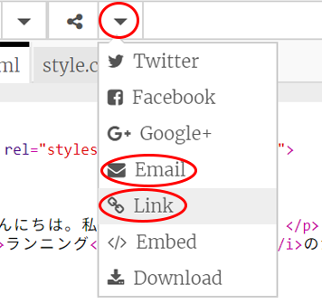

--- challenge ---

## チャレンジ：名前が入ったカードをつくる

+ HTMLとCSSについて学んだことをすべて使い、名前の入ったカードを完成させましょう。バースデーカードである必要はなくて、クリスマスや他の機会のためのものかもしれません！

次に例を示します：

CSSで使う他の色の名前は[ここで](http://jumpto.cc/colours){:target="_blank"}見つけられます。

+ カードが完成したら、誰かと共有したり電子メールで送ったりできます。

--- challenge ---

***

このプロジェクトは以下のボランティアによって翻訳されました。

齊藤哲哉
大野 雅利

ボランティアのおかげで、世界中の人々に母国語で学ぶ機会を与えることができます。翻訳を引き受けていただくことで、より多くの人々に手を差し伸べることができます。詳しくは [rpf.io/translate](https://rpf.io/translate) をご覧ください。