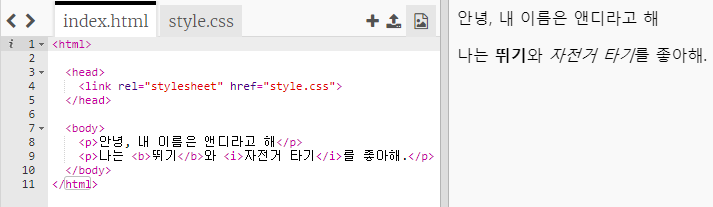
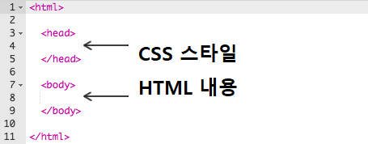
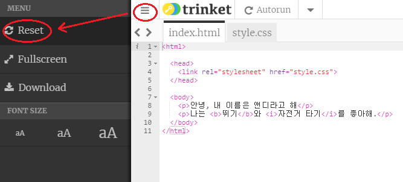
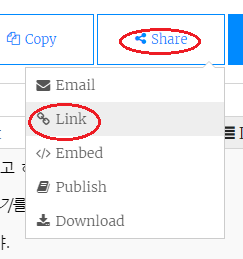
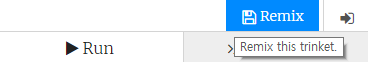

## HTML이란 무엇인가요?

HTML은 **Hypertext Markup Language**의 약자로, 웹 페이지를 제작하는데 사용되는 프로그래밍 언어입니다. 예제를 보도록 하겠습니다!

Trinket.io를 이용해서 HTML 코드를 작성할 수 있습니다.

+ [trinket 열기](http://jumpto.cc/web-intro){:target="_blank"}

프로젝트는 아래와 같을겁니다:



왼쪽에서 볼 수 있는 코드는 HTML이고, 오른쪽에 HTML 코드가 만든 웹페이지가 표시됩니다.

HTML에서는 웹 페이지를 만들 때 **태그**를 사용합니다. 이 HTML 코드 8번째 줄에서 찾아보세요.

```html
<p>안녕, 내 이름은 앤디라고 해.</p>
```

`<p>`은 HTML에서의 tag이며, paragraph의 약자로 **문단**을 의미합니다. `<p>` 태그와 `</p>` 태그 사이에 위치하는 내용이 하나의 문단을 구성합니다.

+ 다른 태그를 찾을 수 있나요?

## \--- collapse \---

## title: 답변

`<b>` 태그는 **이와 같이 글씨를 굵게 하라는 태그로 쓰입니다.**

```html
<b>작동 중. 손대지 마세요!</b>
```

태그에 대해 조금 더 설명하자면:

+ `<html>`과 `</html>`은 HTML 문서의 시작과 끝을 의미합니다.
+ `<head>`과 `</head>`은 CSS 문서가 들어가는 곳입니다. (자세한 내용은 나중에 살펴보도록 하겠습니다.)
+ `<body>` 과 `</body>`은 웹사이트의 내용이 들어가는 곳입니다.



\--- /collapse \---

+ HTML 파일을 왼쪽에서 수정한 후, **실행** 버튼을 클릭하면 오른쪽에서 변경된 홈페이지를 보실 수 있습니다.


+ 만약, 홈페이지를 잘못 만들어서 내용을 전부 수정해야 하는 경우, ** 메뉴** 버튼의 **Reset** 을 클릭하세요.



마지막으로 한 작업을 되돌리고 싶은 경우 `Ctrl` 과 `z` 키를 같이 눌러 수정하시면 됩니다.

### 프로젝트를 저장하기 위해 Trinket 계정이 필요하지 않습니다!

만약, Trinket 계정을 가지고 있지 않다면 **오른쪽 하단**의 **링크를 클릭하세요.** 이 링크로 진행 중인 프로젝트를 계속 진행할 수 있습니다. 링크가 매번 달라지기 때문에 프로젝트를 변경할 때마다 링크를 클릭해야 합니다.



만약 Trinket 계정을 가지고 계신다면, Trinket 상단의 **Remix** 버튼을 클릭하세요. 당신의 프로필에 프로젝트 복사본을 저장할 것입니다.

