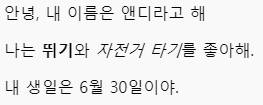

\--- challenge \---

## 과제: 다른 문단 추가

- 당신의 웹 페이지에 다른 2 개의 텍스트 아래에 세 번째 문단을 추가 할 수 있습니까?

새로운 문단은 `
`로 시작해서, `
`로 끝나야 한다는 사실을 기억하십시오.

당신의 웹페이지는 아래와 같이 생겼습니다:

**굵은 글씨**와 <u>밑줄 친 글씨</u>를 구현할 수 있습니까? `<u>`와 `</u>`으로 구현하십시오.

\--- /challenge \---