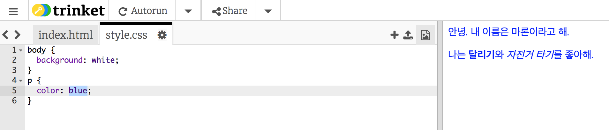

## CSS란 무엇인가요?

CSS는 **Cascading Style Sheets**의 약자로, 사람의 옷과 액세서리 같이 꾸미는 역할을 담당한다고 할 수 있습니다.

+ CSS 파일은 HTML 문서 내 링크로 연결되며, `<head>` 부분에서 찾을 수 있습니다.


CSS에서는 모든 태그의 **속성**을 부여합니다.

+ `style.css`탭을 클릭하여 웹페이지의 CSS 코드를 수정하세요.
    
    

+ 아래 코드를 찾으세요.

```html
p {
    color: black;
}
```

이 CSS 코드는 문단을 의미하는 태그인 `p`의 텍스트 색깔을 검정색으로 지정하라는 것을 의미합니다. (미국식 철자인 'color'이라고 써야합니다.)

+ 'black'을 'blue'로 바꿔 문단의 색깔을 파란색으로 바꿔 보세요. 모든 문단의 색깔이 파란색으로 바뀌는지 확인해보세요.

