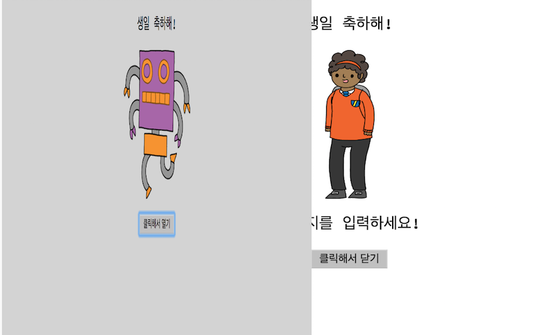
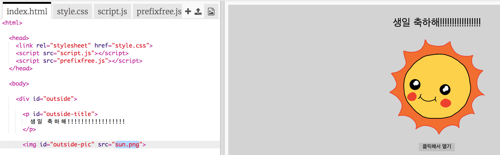
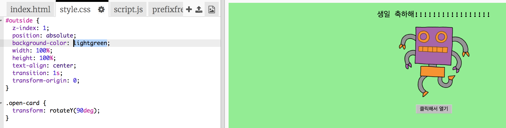
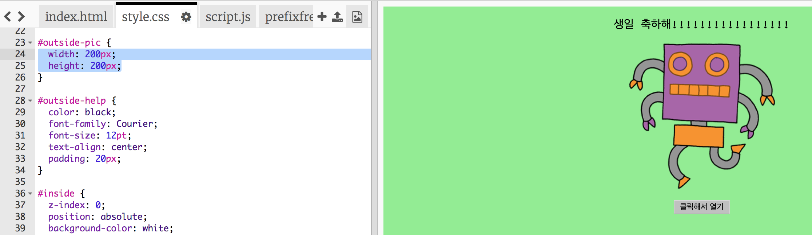
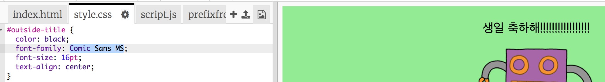

## 생일 카드 만들기

그럼 지금까지 배운 HTML과 CSS를 이용하여 자신만의 생일 카드를 만들어 봅시다.

+ [trinket 열기](http://jumpto.cc/web-card){:target="_blank"}.

지금까지 많은 코드를 작성했지만, 생일 카드는 지금까지 꽤 지루해 보였으므로 아래와 같이 HTML 및 CSS 코드를 일부 변경해야 합니다.

+ 카드 앞면의 버튼을 클릭하면 내부가 보이도록 열릴겁니다.

+ HTML 코드의 14번째 줄로 이동하여, 자신만의 문구를 쓰세요.

+ HTML Code에서 `robot`을 찾아서 `sun`으로 바꿔보세요.

\--- hints \--- \--- hint \---

+ 17번째 줄에 있는 코드를 보세요.
+ `robot`을 `sun`으로 바꾸면, 이미지가 바뀝니다!

 \--- /hint \--- \--- /hints \---

`boy`, `diamond`, `dinosaur`, `flowers`, `girl`, `rainbow`, `robot`, `spaceship`, `sun`, `tea`, or `trophy` 를 생일 카드에 쓸 수 있으며, `cracker`, `elf`, `penguin`, `present`, `reindeer`, `santa`, `snowman` 를 크리스마스 카드에 쓸 수 있습니다.

생일 카드의 CSS 코드도 수정해야 합니다.

+ `style.css` 탭을 클릭해보세요. 첫번째 부분은 카드**바깥쪽**에 쓰이는 CSS 코드입니다.

+ `background-color`를 `lightgreen`으로 바꿔보세요.

+ 이미지의 크기도 변경할 수 있습니다. `#outside-pic` CSS 코드에서 `width`(너비) 와 `height`(높이) 값을 수정하여, 바깥 쪽에 있는 이미지를 `200px`로 수정해보세요. (`px`는 픽셀을 의미합니다.)

+ 폰트도 바꿀 수 있습니다.`#outside-title` 에서 `font-family`를 `Comic Sans MS`로, `font-size` 를 `16pt`로 바꿔보세요.

다른 폰트를 사용하고 싶으시다면 아래와 같이 코드를 작성하시면 됩니다.

+ `arial`
+ `Impact`
+ `Tahoma`