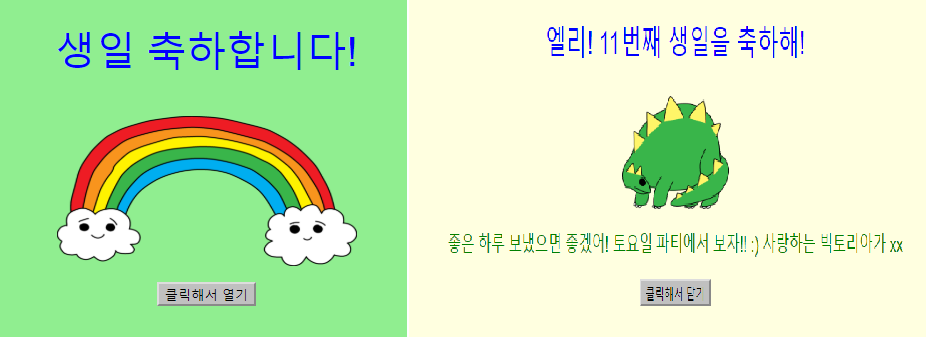
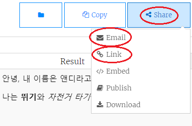

--- challenge ---

## 과제: 자신만의 카드 만들기

+ 지금까지 배운 HTML과 CSS 지식을 총동원하여, 자신만의 카드를 제작해 보세요. 꼭 생일카드일 필요는 없으며, 크리스마스 카드나 다른 행사를 위한 카드를 제작해도 됩니다!

아래 예제를 참고하세요:

더 많은 CSS 색상을 [여기서](http://jumpto.cc/colours){:target="_blank"} 찾을 수 있습니다.

+ 카드를 작성한 후에 이메일로 다른 사람과 카드를 공유해 보세요.

--- /challenge ---

***
### 커뮤니티 기여 번역 

이 프로젝트는 **강태원** 가 번역하였고 **이유빈** 가 검토하였습니다. 

우리의 놀라운 번역 자원 봉사자들은 전 세계의 어린이들에게 코딩을 배울 수 있는 기회를 제공합니다. 우리 프로젝트 번역에 참여하여 더 많은 아이들에게 도움을 줄 수 있습니다. 자세한 내용은 [rpf.io/translators](https://rpf.io/translators)에서 확인하세요.
