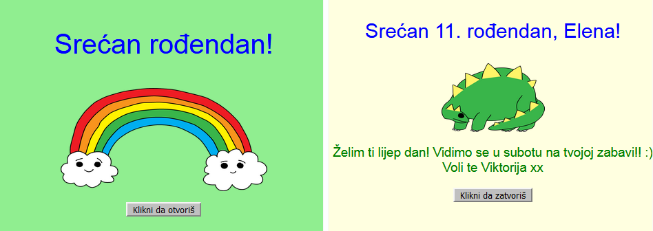

## Uvod

U ovom projektu upoznaćeš se sa HTML-om i CSS-om i naučiti kako da izradiš sopstvenu rođendansku čestitku.

### Šta ćeš napraviti

Klikni na dugme da otvoriš rođendansku čestitku:

  <iframe src="https://trinket.io/embed/html/de64e9e3db?outputOnly=true&start=result" width="600" height="450" frameborder="0" marginwidth="0" marginheight="0" allowfullscreen>
  </iframe>
  

### Šta ćeš naučiti

Ovim projektom obuhvaćeni su elementi iz sljedećih dijelova [Raspberry Pi Digital Making Curriculum](http://rpf.io/curriculum){:target="_blank"}:

+ [Dizajniranje osnovnih 2D i 3D elemenata](https://www.raspberrypi.org/curriculum/design/creator){:target="_blank"}.

### Dodatne informacije za nastavnike

Ukoliko je potrebno da odštampate ovaj projekat, koristite [verziju za štampu](https://projects.raspberrypi.org/me-ME/projects/happy-birthday/print){:target="_blank"} .

Koristite link koji se nalazi u podnožju stranice da pristupite GitHub repozitorijumu za ovaj projekat, koji sadrži sve izvore (uključujući primjer završenog projekta) u 'me-ME/resources' folderu.