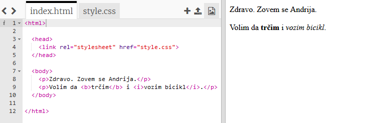
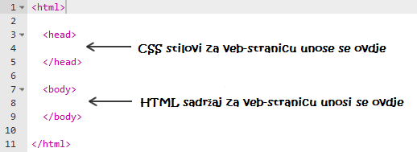
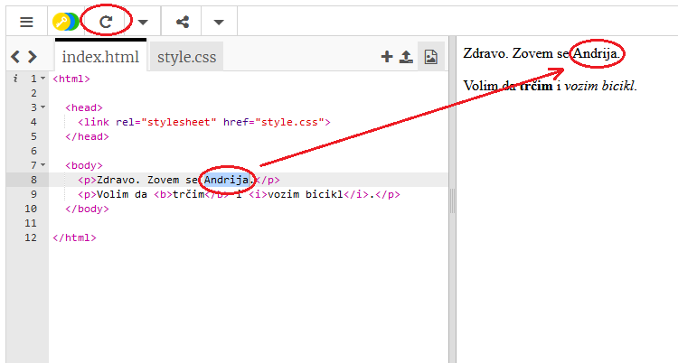
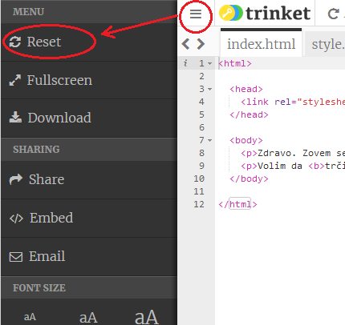
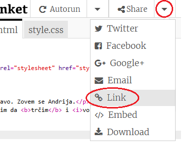
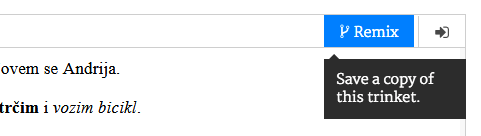

## Šta je HTML?

HTML je skraćenica za **Hypertext Markup Language** (Jezik za označavanje hiperteksta) i to je jezik koji se koristi za izradu veb-stranica. Pogledajmo primjer!

Za pisanje HTML kôda koristićeš veb-sajt pod nazivom trinket.io.

+ Otvori [ovaj trinket](http://jumpto.cc/web-intro){:target="_blank"}.

Projekat treba da izgleda ovako:



Kôd koji vidiš na lijevoj strani je HTML. Na desnoj strani trinketa možeš da vidiš veb-stranicu koju je napravio HTML kôd.

HTML koristi **oznake** (tags) za izradu veb-stranica. Pogledaj ovaj HTML kôd u osmom redu svog kôda:

```html
<p>Zdravo. Zovem se Andrija.</p>
```

`<p>` je primjer oznake, i to je skraćenica za **paragraph** (pasus). Pasus možeš da započneš oznakom `<p>` i da ga završiš oznakom `</p>`.

+ Da li možeš da uočiš neku drugu oznaku?

## \--- collapse \---

## title: Odgovor

Jedna od oznaka koju možeš da uočiš je oznaka `<b>` koja znači **bold** (podebljano):

```html
<b>trčim</b>
```

Evo još nekoliko primjera:

+ `<html>` i `</html>` označavaju početak i kraj HTML dokumenta
+ `<head>` i `</head>` - ovdje se unose stvari kao što je CSS (do toga ćemo doći kasnije)
+ `<body>` i `</body>` - ovdje se unosi sadržaj veb-stranice



\--- /collapse \---

+ Napravi izmjenu u jednom pasusu teksta u HTML dokumentu (lijevo). Klikni na **Run** i trebalo bi da vidiš promjenu na svojoj veb-stranici (desno)!



+ Ako napraviš grešku i želiš da poništiš sve svoje izmjene, možeš da klikneš na dugme **menu**, a zatim na **Reset**.



Da poništiš samo ono što si posljednje uradio/uradila, možeš istovremeno da pritisneš tastere `Ctrl` i `z`.

### Nije ti potreban Trinket nalog da sačuvaš svoje projekte!

Ako nemaš Trinket nalog, klikni na strelicu **nadolje**, a zatim klikni na **Link**. Dobićeš link koji možeš sačuvati i vratititi se na njega kasnije. Biće potrebno da to uradiš svaki put kada napraviš izmjene, pošto će se link promijeniti!



Ako imaš Trinket nalog, najlakši način da sačuvaš svoju veb-stranicu je da klikneš na dugme **Remix** koje se nalazi u gornjem dijelu trinketa. Tako će kopija trinketa biti sačuvana na tvom profilu.

