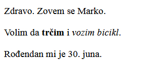

--- challenge ---

## Izazov: dodaj još jedan pasus

- Da li možeš, ispod dva postojeća, da dodaš treći pasus teksta na svoju veb-stranicu?

Ne zaboravi da tvoj novi pasus treba da počne oznakom `
` i da se završi oznakom `
`.

Tvoja veb-stranica bi mogla da izgleda ovako:

Možeš li u svoj novi pasus da dodaš **podebljan** i <u>podvučen</u> tekst? Za podvučen tekst koristi oznake `<u>` i `</u>`.

--- /challenge ---