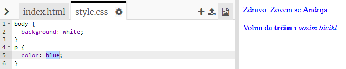

## Šta je CSS?

CSS je skraćenica za **Cascading Style Sheets** (Kaskadne liste stilova) i to je jezik koji se koristi za stilizovanje i uljepšavanje veb-stranica.

+ Ovaj kôd povezuje tvoju veb-stranicu sa CSS datotekom — pogledaj da li možeš da ga nađeš u `<head>` HTML dokumenta:


CSS navodi sva **svojstva** za pojedinu oznaku.

+ Klikni na `style.css` karticu da pogledaš CSS kôd za svoju veb-stranicu.
    
    

+ Pronađi ovaj kôd:

```html
p {
    color: black;
}
```

Ovaj CSS kôd određuje jedno svojstvo za pasuse (`p`) u kojem se kaže da boja teksta treba da bude crna.

+ U CSS kôdu promijeni riječ 'black' u 'blue'. Boja teksta u svim pasusima promijeniće se u plavu.

