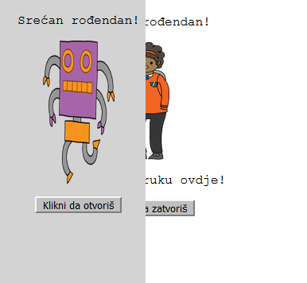
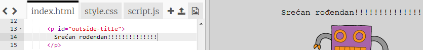
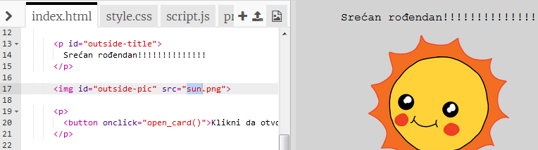
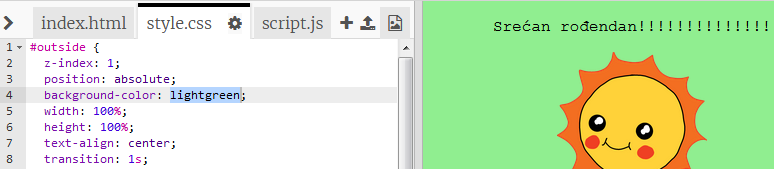
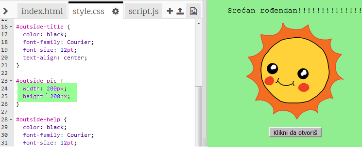
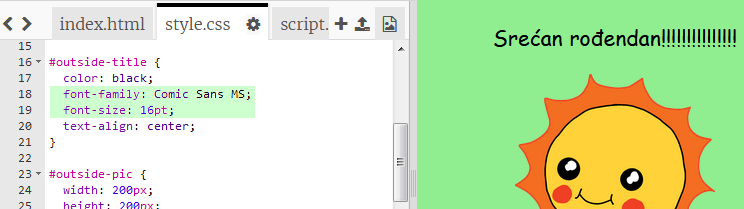

## Izrada rođendanske čestitke

Iskoristimo to što već znaš o HTML-u i CSS-u da napraviš svoju sopstvenu rođendansku čestitiku.

+ Otvori [ovaj trinket](http://jumpto.cc/web-card){:target="_blank"}.

Na početku smo napisali mnogo kôda, ali rođendanska čestitka izgleda prilično dosadno, pa ćeš zato napraviti neke izmjene u HTML i CSS kôdu.

+ Klikni na dugme na prednjoj strani čestitke i vidjećeš kako se otvara i pokazuje unutrašnju stranu.

+ Pređi na 14. red kôda. Pokušaj da urediš tekst čestitke prema sopstvenoj želji.

+ Da li možeš da pronađeš HTML kôd za sliku robota i da promijeniš riječ `robot` u `sun`?

\--- hints \--- \--- hint \---

+ Da nađeš kôd, pogledaj 17. red.
+ Promijeni riječ `robot` u `sun` i vidjećeš da se slika promijenila!

 \--- /hint \--- \--- /hints \---

Možeš da koristiš bilo koju od sljedećih riječi za rođendansku čestitku: `boy`, `diamond`, `dinosaur`, `flowers`, `girl`, `rainbow`, `robot`, `spaceship`, `sun`, `tea` ili `trophy`. Ili, ako želiš da napraviš božićnu čestitku, možeš koristiti neku od ovih riječi: `cracker`, `elf`, `penguin`, `present`, `reindeer`, `santa` ili `snowman`.

Možeš da modifikuješ i CSS kôd rođendanske čestitke.

+ Click on the tab for `style.css`. The first part is all of the CSS styles for the **outside** of the card.

+ Change the `background-color` to `lightgreen`.

+ You can also change the size of an image. Go to the `#outside-pic` CSS code, and change the `width` and `height` of the outside image to `200px` (`px` stands for pixels).

+ The font can be changed too. Go to the `#outside-title` CSS and change the `font-family` to `Comic Sans MS` and the `font-size` to `16pt`.

You can use other fonts, for example:

+ `arial`
+ `Impact`
+ `Tahoma`