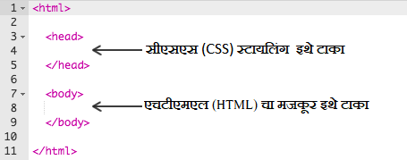
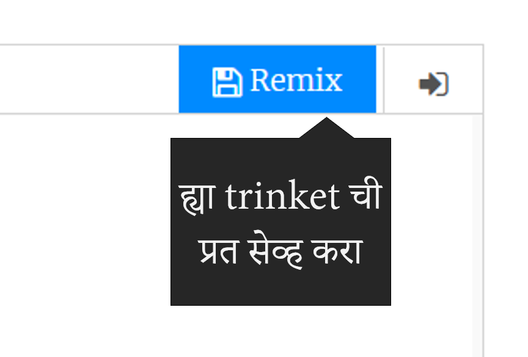

## HTML म्हणजे काय?

HTML म्हणजे **हायपरटेक्स्ट मार्कप लँग्वेज (Hypertext Markup Language)**, एक भाषा जी वेब-पेज बनवायला वापरली जाते. ह्याकरता आपण एक उदाहरण पाहूया!

आपण HTML कोड लिहिण्यासाठी trinket.io नावाची वेबसाइट वापरणार आहोत.

+ [ हे trinket](http://jumpto.cc/web-intro){:target="_blank"} उघडा.

प्रकल्प यासारखा दिसायला हवा:


डावीकडे दिसणारा कोड हा HTML आहे. trinket च्या उजव्या बाजूला तुम्हाला HTML कोड मुळे तयार झालेलं वेबपेज दिसेल.

HTML मध्ये वेबपेज तयार करायला **टॅग्ज (tags)** चा वापर केला जातो. खालील HTML कोड तुमच्या कोड मध्ये आठव्या (8) ओळीवर पहा:

```html
<p>Hi. My name is Andy.</p>
```

`<p>` हे एका टॅग चं उदाहरण झालं, ज्याचा अर्थ **परिच्छेद अथवा पॅराग्राफ (paragraph)** होतो. तुम्ही `<p>` वापरून नवीन परिच्छेदाची सुरुवात करू शकता आणि परिच्छेदाचा शेवट `</p>` वापरून करू शकता.

+ आपण इतर अजून टॅग शोधू शकता का?

--- collapse ---
---
title: उत्तर
---

तुम्हाला अजून एक दिसला असेल तो म्हणजे `<b>`, ज्याचा अर्थ **ठळक** होतो:

```html
<b>running</b>
```

अजून काही टॅग:

+ `<html>` आणि `</html>` HTML डॉक्युमेंट ची सुरुवात आणि शेवट दर्शवतात
+ `<head>` आणि `</head>` मध्ये CSS मजकूर टाकला जातो (आपण त्याबद्दल नंतर जाणून घेऊया)
+ `<body>` आणि `</body>` मध्ये आपल्या वेबपेज चा सगळा मजकूर टाकला जातो



--- /collapse ---

+ HTML फाईल मधल्या (डावीकडच्या) एका परिच्छेदात बदल करा. (उजवीकडे असलेल्या) **Run** बटनावर क्लिक केल्यावर तुम्हाला वेबपेज मधले बदल दिसतील!


+ जर तुमच्याकडून एकादी चूक झाली असेल आणि तुम्हाला सगळं पहिल्यापासून करायचं असेल तर, तुम्ही **menu** बटनावर क्लिक करून मग **Reset** वर क्लिक करू शकता.


तुम्ही लगेच 'केलेले बदल पूर्वीप्रमाणे करण्यासाठी तुम्ही कीबोर्ड वरती `Ctrl` आणि `z` बटणं दाबू शकता.

### तुमचे प्रकल्प सेव्ह करण्यासाठी तुम्हाला Trinket खातं असण्याची गरज नाही!

तुमचं Trinket खातं नसेल तर, **down** बाणावर क्लिक करून **Link** वर क्लिक करा. यातून आपल्याला एक लिंक मिळेल ज्याचा वापर करून तुम्ही तिथे नंतर परत जाऊ शकता. लिंक बदलल्यामुळे तुम्ही जेव्हा प्रकल्पात बदल कराल तेव्हा तुम्हाला प्रत्येक वेळी या पद्धतीने नवीन लिंक तयार करून त्याचा वापर करावा लागेल!


तुमचं Trinket खातं असेल तर तुमचं वेबपेज सेव्ह करण्याची सगळ्यात सोप्पी पद्धत म्हणजे trinket वरच्या **Remix** बटन दाबणे. त्याने तुमच्या खात्यावर Trinket ची एक प्रत सेव्ह केली जाईल.

