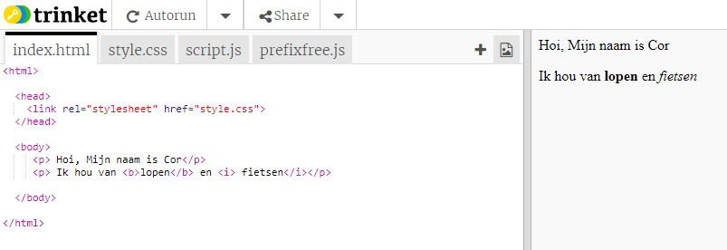
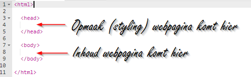
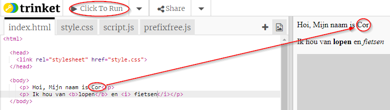
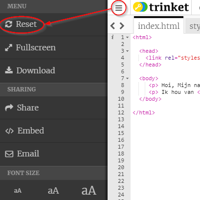
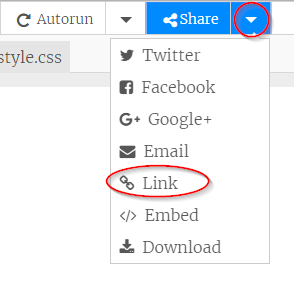
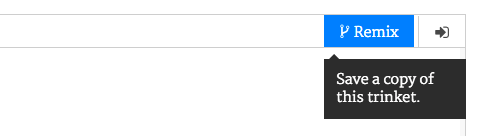

## Wat is HTML?

HTML staat voor ** Hypertext Markup Language **, de taal die wordt gebruikt om webpagina's te maken. Laten we een voorbeeld bekijken!

Je gaat een website genaamd trinket.io gebruiken om HTML-code te schrijven.

+ Open [deze trinket](http://jumpto.cc/web-intro){:target="_blank"}.

Het project zou er als volgt uit moeten zien:



De code die je links ziet, is HTML. Aan de rechterkant van de trinket kun je de webpagina zien die de HTML-code heeft gemaakt.

HTML gebruikt ** tags ** om webpagina's te bouwen. Zoek naar deze HTML-code op regel 8 van je code:

```html
<p> Hoi, mijn naam is Cor.</p>
```

`<p>` is een voorbeeld van een tag en is een afkorting voor ** alinea (paragraph) **. Je kunt een alinea met `<p>` starten en een alinea met beëindigen `</p>`.

+ Kun jij andere tags ontdekken?

## \--- collapse \---

## title: Antwoord

Een andere tag die je mogelijk gezien hebt, is `<b>`, wat staat voor ** vetgedrukt (bold) **:

```html
<b>running</b>
```

Hier zijn er nog meer:

+ `<html>` en ` </html>` markeren het begin en het einde van het HTML-document
+ `<head>` en ` </head>` is waar dingen zoals CSS komen (we komen daar later op terug)
+ `<body>` en ` </body>` is waar je website-inhoud komt



\--- /collapse \---

+ Breng een wijziging in een van de alinea's met tekst aan ( in het HTML-bestand aan de linkerkant). Klik op ** Click To Run **, en je zou je webpagina (aan de rechterkant) moeten zien veranderen!



+ Als je een fout hebt gemaakt en al je wijzigingen ongedaan wilt maken, kunt je klikken op de ** menu ** knop en vervolgens op ** Reset **.



Om alleen het laatste wat je deed ongedaan te maken, kun je tegelijkertijd op de ` Ctrl ` en ` z ` toets drukken.

### Je hebt geen Trinket-account nodig om je projecten op te slaan!

If you don't have a Trinket account, click the **down** arrow and then click **Link**. This will give you a link that you can save and come back to later. You'll need to do this every time you make changes, as the link will change!



If you have a Trinket account, the easiest way to save your webpage is to click the **Remix** button on the top of the trinket. This will save a copy of the trinket on your profile.

