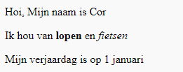

--- challenge ---

## Uitdaging: voeg een nieuwe alinea toe

- Kun je onder de andere twee paragrafen een derde paragraaf toevoegen?

Vergeet niet dat je nieuwe alinea moet beginnen met een `
` tag en eindigen met `
` tag.

Zo ziet je webpagina eruit:

Kun je **bold (vet)** en <u> underlined (onderstreepte) </u> tekst aan je nieuwe paragraaf toevoegen? Gebruik `<u>` en `</u>` tags voor onderstreepte tekst.

--- /challenge ---